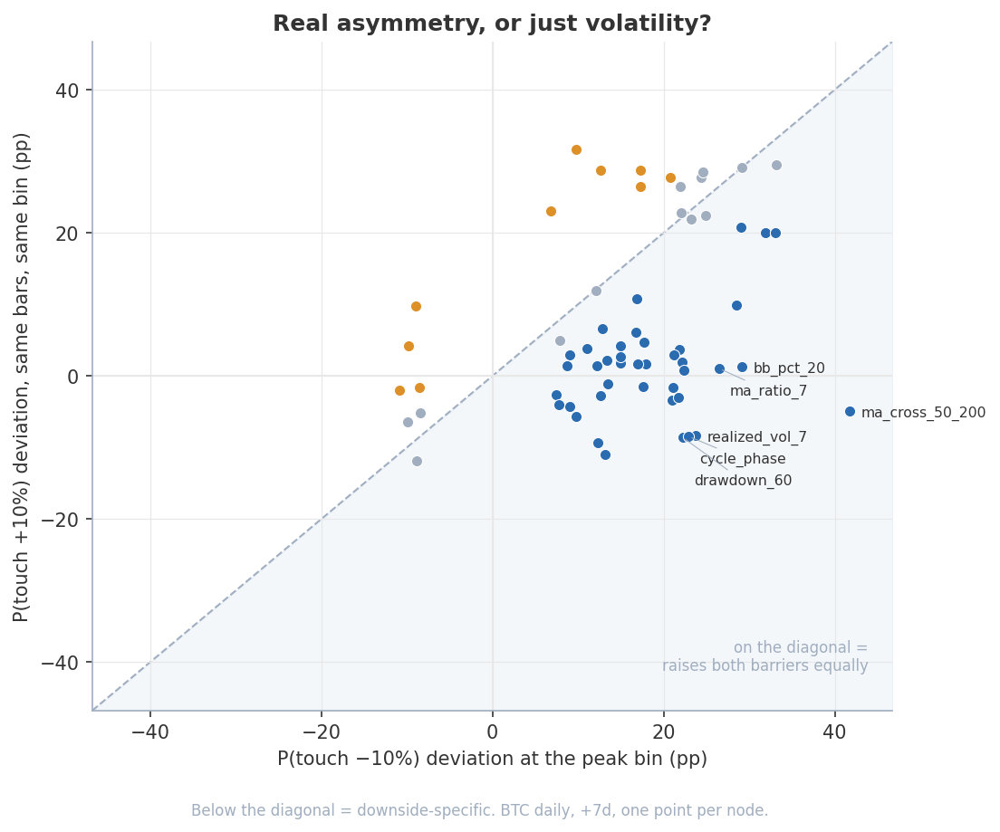
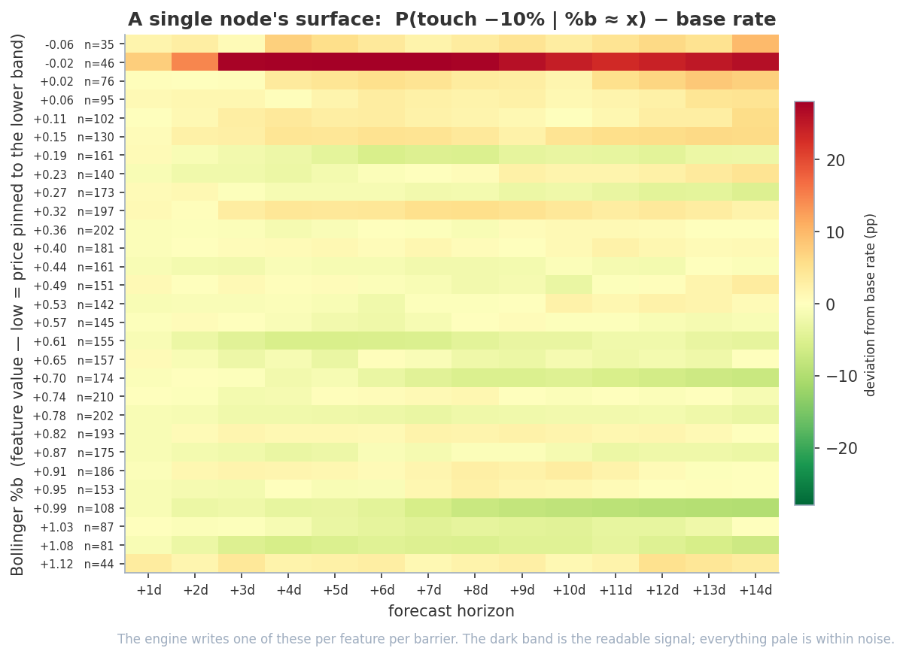

# Empirical Barrier-Touch Testing on Any Financial Asset

> "Where will price be on Friday?" is the wrong question. A stop, a liquidation, an
> option and a margin call all respond to something else: **did price ever reach this
> level?** This measures that — both barriers, on the same bars, against a shuffled
> null. Doing both at once turns out to matter more than doing either one well.


You declare a universe of **conditions** — each a feature $X$ (RSI, moving-average
deviation, realized volatility, on-chain valuation, time-of-day, …) paired with a
forward horizon $h$ — and an agent drives the pipeline through every one against
history, unattended. For each condition it counts

$$
P\left(\text{touch} \mid X_t \in \text{condition}\right) - P\left(\text{touch}\right)
$$

the deviation of the conditional touch probability from its unconditional base rate.
There is no fitted model and no forecast in the machine-learning sense — only
conditional counting over the historical record, run in batch across hundreds of
feature-and-parameter combinations, with **every headline number falsified against a
shuffled null**.

* * *

## What makes this different

- **First passage, not endpoints.** The event is $\min(P_{t+1..t+h})/P_t - 1 < -\theta$
  (or its mirror above $+\theta$) — price *touching* a level at any point in the window.
  A spike that round-trips counts; a close-to-close test would miss it entirely.
- **Two barriers, always.** The same features are measured against $-\theta$ and
  $+\theta$ on identical bars. This is the whole point: a condition that raises the
  downside touch probability might be finding real downside risk, or might just be
  finding **volatility** — in which case it raises the upside barrier by exactly as
  much. Counting one barrier cannot tell those apart. Counting both can.
- **Falsification is built in.** A node's headline is a *maximum* over ~30 threshold
  bins, which is biased upward even for a feature that carries nothing. `--validate`
  builds the null distribution of that exact statistic by circularly shifting the
  outcome against the feature, then reads the real value as a quantile of it and
  corrects for the size of the search.
- **Batch, unattended, reproducible.** Add a `universe.json`, walk away, come back to
  196 surfaces and a structured verdict per family. `python run.py --charts`
  regenerates every figure in this README from files already in the repo, no data fetch.

* * *

## Results at a glance

Everything below is reported **against the null**, not against a fixed threshold. For
BTC the null median of a node's peak statistic is ~10 pp at +3d and ~17 pp at +14d —
the same magnitude as most "edges" a naive read would report.

### Both barriers carry structure — and the upside carries more

| Workspace | Barrier | Base rate | Tests | `structure` (clears Bonferroni) | `nominal` (p<0.05) | Expected by chance |
|-----------|---------|-----------|-------|-------------------|--------------------|--------------------|
| `btc_daily_14days` | −10% within 14d | 21.7% | 195 | **5** | 57 | 9.8 |
| `btc_daily_14days` | +10% within 14d | 31.9% | 195 | **15** | 92 | 9.8 |
| `nasdaq_hourly_24hrs` | −2% within 24h | 26.6% | 132 | **3** | 32 | 6.6 |
| `nasdaq_hourly_24hrs` | +2% within 24h | 25.7% | 132 | **15** | 62 | 6.6 |


That the *upside* barrier shows three to five times as much structure as the downside —
**on both assets independently** — is not the intuitive result, and taken alone it would
be easy to misread as "these features predict rallies." They don't. The two-barrier view
says what is actually going on.

The NASDAQ sweep gives the game away on its own: of the 15 tests clearing Bonferroni on
the +2% barrier, the qualifying nodes are `vix_level`, `realized_vol_12`,
`realized_vol_24`, `roc_6`, `roc_12`, `macd_12_26` and `time_of_day`. The best
predictors of touching a barrier are *literally volatility measures* and the intraday
volatility smile. Nothing here is forecasting direction; it is forecasting the size of
the move, and a bigger move touches both barriers.

### The finding: most of it is volatility, not direction



`--skew` evaluates both barriers at the *same slice of feature space* on the *same
bars*, so the two deviations are directly comparable. Running it over the five BTC
tests that clear Bonferroni on the downside barrier:

| Node | Horizon | P(touch −10%) dev | P(touch +10%) dev | Skew | Reading |
|------|---------|------------------:|------------------:|-----:|---------|
| `bb_pct_20` | +7d | +29.2 pp | +1.3 pp | **+27.8** | genuinely downside |
| `bb_pct_20` | +3d | +27.8 pp | +1.7 pp | **+26.0** | genuinely downside |
| `drawdown_7` | +3d | +25.6 pp | +1.4 pp | **+24.2** | genuinely downside |
| `ma_ratio_7` | +3d | +20.9 pp | +5.9 pp | +14.9 | mostly downside |
| `ma_cross_7_21` | +3d | +19.8 pp | +21.3 pp | **−1.5** | **symmetric — volatility, not direction** |

`ma_cross_7_21` clears Bonferroni as a downside-touch predictor with $p = 1.5\times10^{-4}$
and *still carries no directional information whatsoever* — it moves the upside barrier
slightly more than the downside one. It is a volatility detector wearing a crash
detector's clothes. A single-barrier pipeline would have reported it as a validated
crash signal, and would have been wrong in a way no amount of additional significance
testing could catch.

The same correction applies to the headline signal:


Price more than ~130% above its 200-day moving average precedes a −10% touch within
14 days at **+39 pp over a 21.7% base rate** ($n = 82$), rising monotonically at every
threshold beneath it. Real, and large. But the same condition raises the *+10%* touch
probability by +24 pp — so roughly three-fifths of that "crash signal" is simply
"a big move is coming." At +7d the two are **+29.2 vs +29.1** — a skew of exactly
zero. Overextension predicts *magnitude*; only a fraction of it predicts *sign*.



Every feature produces a surface like this. The readable band here is price pinned to
the lower Bollinger band — elevated −10% touch risk across every horizon — against a
pale (within-noise) background everywhere else. `bb_pct_20` is the one signal in the
set that is *both* significant and genuinely asymmetric.

### Reading it together

Volatility clustering and the leverage effect are well documented and not arbitraged
away, and that is most of what shows up here. What the scan finds is overwhelmingly
**conditional variance, not conditional mean** — which is the expected shape, since the
mean is the most competed-away quantity in a liquid market. The contribution of the
two-barrier design is that it *measures* the difference instead of assuming it.

Two caveats bound the result:

1. **The null is conservative.** Circular shifting preserves each series'
   autocorrelation but not the joint regime structure; where both series share a slow
   regime component — as they do for touch events — this inflates the null, so these
   results are if anything understated. A block bootstrap would tighten them.
2. **Significance is not tradability.** These are in-sample conditional probabilities
   over the full history, not a walk-forward backtest with costs.
   [`research/drawdown_overlay/`](research/drawdown_overlay/) follows the
   Bonferroni-clearing nodes all the way to an equity curve with discrete,
   horizon-matched trades and costs. The skew table above predicts what it finds:
   trigger bars are *weak* but not *negative* (forward 1-bar return +0.024% vs +0.244%
   elsewhere), so shorting the signal never gets ahead of BTC's drift — while holding
   **flat** over the same windows beats buy-and-hold on risk-adjusted terms in and out
   of sample (walk-forward Calmar 1.08 vs 0.72, max drawdown −83% → −66%). A real
   p-value bought a risk overlay, not a return engine.

* * *

## Try it on your own asset

A workspace is one asset + one sampling interval + one barrier + its feature universe.
Adding one requires **no changes to root code**.

```bash
pip install -r requirements.txt

# 1. drop in workspaces/<name>/universe.json  (asset, horizons, barrier, feature families)
python run.py --workspace <name> --status          # inventory, for the declared barrier
python run.py --workspace <name> --family rsi      # compute a family of surfaces
python run.py --workspace <name> --read rsi_14     # inspect one
python run.py --workspace <name> --validate        # shuffle-null every tested node
python run.py --workspace <name> --skew            # both barriers, same bars
python run.py --workspace <name> --findings        # structured verdict per family

# the mirror barrier writes to its own directories and never collides
python run.py --workspace <name> --outcome runup --family rsi
```

**Scale $\theta$ to the asset and horizon.** A 10% barrier over 14 BTC days is a 21.7%
event; the same 10% over 24 NASDAQ hours is a **0.4%** one, which cannot be measured at
all. $\theta$ is declared per workspace in `universe.json`, and the pipeline refuses to
write a surface below a 5% base rate rather than emit something that looks real:

| θ | BTC daily, +14d | | NASDAQ hourly, +24h | |
|---|---|---|---|---|
| | P(touch −θ) | P(touch +θ) | P(touch −θ) | P(touch +θ) |
| 1% | 71.2% | 79.9% | 46.6% | 55.0% |
| **2%** | 61.8% | 73.6% | **26.6%** | **25.7%** |
| 5% | 41.3% | 53.7% | 3.1% | 3.6% |
| **10%** | **21.7%** | **31.9%** | 0.4% | 0.3% |

A **cross-asset feature** (any OHLCV series) is registered in `data/features.py`:

```python
def _my_feature(close: pd.Series, period: int) -> pd.Series:
    ...

register('my_feature', lambda d, p: _my_feature(d['close'], p['period']))
```

A **workspace-specific feature or data source** (on-chain metric, custom API) goes in
`workspaces/<name>/plugin.py`, imported automatically when the workspace loads:

```python
from data import features, fetcher

def _my_source(start: str, asset: dict) -> pd.DataFrame:   # DatetimeIndex-ed frame
    ...

fetcher.register_source('my_source', _my_source)
```

Barriers are a registry too — `outcomes.register(...)` at import time aims the whole
pipeline at a different event with no root edits.

* * *

## How it works

### 1. Base rate

For a horizon $h$ (in bars), the outcome at time $t$ is an indicator

$$
\mathbb{1}\left[\min\left(P_{t+1}, \dots, P_{t+h}\right) / P_t - 1 < -\theta\right]
$$

for the downside barrier, and its mirror with $\max$ and $> +\theta$ for the upside one.
The window starts at $t+1$: the barrier can only be touched *after* the bar the
condition is read on. The unconditional **base rate** is the historical mean $p_0(h)$.
Rows with $n < 20$ are undefined; the last $h$ bars of every horizon's sample have no
realized outcome and are dropped.

### 2. Conditional surface (CDF) and local recovery (PDF)

A node computes a feature series $X_t$, then evaluates 30 thresholds spanning its
2nd–98th empirical percentiles. For each threshold $x$ and horizon $h$ it records two
cumulative deviations:

$$
\Delta_{>}(x, h) = P\left(\text{touch} \mid X_t > x\right) - p_0(h),
\qquad
\Delta_{<}(x, h) = P\left(\text{touch} \mid X_t < x\right) - p_0(h)
$$

Differencing adjacent cumulative rows recovers the **local** (PDF) edge — the deviation
for observations whose feature value falls *within* an interval — from which the
combiner interpolates the edge at any current feature value. Each node is written as an
`.xlsx` with three colour-scaled tabs (PDF, CDF-above, CDF-below). The colour scale is
derived from the base rate rather than fixed, and the barrier's registry entry carries a
sign, so **red always means worse**: a higher downside-touch probability is red, a higher
upside-touch probability is green. Observation counts report the longest-horizon (most
conservative) count.

### 3. Signal combination — Naive Bayes in log-odds

`--probe` selects the single node per family with the highest peak absolute deviation
at the pivot horizon (subject to $n \geq 30$ slices), then combines the survivors in
log-odds space. Assuming conditional independence given the outcome,

$$
\mathrm{logit}\,p_\mathrm{comb}(h) = \mathrm{logit}\,p_0(h) + \sum_i w_i \left[ \mathrm{logit}\left(p_0(h) + \delta_i(h)\right) - \mathrm{logit}\,p_0(h) \right]
$$

where $\delta_i(h)$ is family $i$'s local deviation at the current feature value. The
independence assumption is deliberately optimistic — correlated signals inflate the
combined edge — and the tool flags it. Thin slices are shrunk toward zero with a CLT
floor at $n_0 = 30$ and half-weight scale $N_0 = 50$:

$$
w(n) = \begin{cases}
0 & n < 30 \\
\frac{n - 30}{(n - 30) + 50} & n \geq 30
\end{cases}
$$

### 4. Shuffle-null validation

A node's peak absolute deviation across ~30 bins is a **maximum over many noisy
estimates**, biased upward even when the feature carries nothing: with $n \approx 50$
per bin the standard error of a rate is $\sqrt{0.25/50} \approx 7$ pp, and the max
over 30 such bins lands near 10 pp by construction. Comparing a peak against a fixed
pp threshold measures how many bins were searched, not whether there is signal.

`--validate` builds the null of that same statistic directly. The outcome series is
circularly shifted against the feature many times; each shift preserves the
autocorrelation of both series — which matters, because overlapping $h$-bar outcomes
are strongly serially correlated — while destroying any real alignment. The real peak
is read as a quantile of that null:

$$
p = \frac{1 + \mathrm{count}\left(\text{shift peak} \geq \text{real peak}\right)}{1 + n_\mathrm{shifts}}
$$

The add-one estimator (Davison & Hinkley) keeps $p$ strictly positive; its floor,
$1/(n_\mathrm{shifts}+1)$, is also the resolution limit, so a sweep of $k$ tests needs a
Bonferroni $\alpha/k$ and nothing below the floor can be resolved. BTC sweeps run 39,000
shifts against $\alpha = 2.56\times10^{-4}$; NASDAQ runs 27,000 against
$3.79\times10^{-4}$.

| Verdict | Meaning |
|---------|---------|
| `structure` | Clears $\alpha/k$; survives correction for the size of the search |
| `nominal` | Clears $\alpha$ alone — what a single-node view would call an edge |
| `underpowered` | Sits at the resolution floor; might clear $\alpha/k$, but this many shifts cannot show it |
| `noise` | Indistinguishable from the null |

Results are written to `validation.<event>.json`. Re-running with `--families`
**merges** into that file, and the Bonferroni denominator is taken over every test the
file contains.

### 5. Skew — the second barrier

`--skew` finds the bin where the downside deviation peaks, then reads the **upside**
deviation at that same bin, on the same bars, each net of its own base rate. The
difference is the asymmetry. The baseline is itself asymmetric — BTC touches +10% more
often than −10% simply because it drifts up — which is exactly why both barriers must
be measured rather than assumed symmetric.

### 6. Calibration, not accuracy

`--backtest` walks the combiner over historical sample dates and asks whether the
probability it emits is *right*: when it says 40%, is the barrier touched 40% of the
time? It reports a calibration table plus a **Brier skill score** against the base rate.
"Directional accuracy" is meaningless for a touch event, and when the base rate is far
from 50% it also flatters a model that only ever predicts the majority class. On BTC
`dd10` the combined signal scores $+0.26$ at +14d and $-0.07$ at +3d — genuine skill at
the long horizon, worse than simply quoting the base rate at the short one.

### 7. Pluggable barriers

| `--outcome` | Event | Sign |
|-------------|-------|------|
| `drawdown` | $\min(P_{t+1..t+h}) / P_t - 1 < -\theta$ | more is worse |
| `runup` | $\max(P_{t+1..t+h}) / P_t - 1 > +\theta$ | more is better |

Both are one signed `_touch` primitive. Every artifact is scoped by the barrier's event
label (`dd10`, `run10`, `dd2`, …) — surfaces, logs, skip records, validation and
findings — so two barriers or two thresholds never overwrite each other.

Node progress is **derived from disk**: a node is tested for a barrier iff its xlsx
exists under that barrier's directory. `universe.json` is a pure declaration and is
never written back by the pipeline.

* * *

## Repository layout

```
run.py               ← thin CLI dispatcher
workspace.py         ← Workspace class; loads universe.json + optional plugin
data/
  features.py        ← FeatureRegistry: register() / compute()
  fetcher.py         ← SourceRegistry:  register_source() / fetch()
engine/
  matrix.py          ← base rate + conditional CDF surfaces
  outcomes.py        ← OutcomeRegistry: the barrier being measured
  writer.py          ← xlsx rendering, base-rate-scaled colour, PDF recovery
  combiner.py        ← Naive Bayes log-odds combination + shrinkage
  validate.py        ← circular-shift null test + Bonferroni verdicts
  charts.py          ← regenerates the README figures from committed data
tree/
  tree.py            ← node traversal over universe.json
workspaces/
  <name>/
    universe.json    ← asset, horizons, barrier, feature families, all config
    plugin.py        ← (optional) custom features and data sources
    <family>/<event>/     ← surfaces, run log, skip records
    validation.<event>.json
    findings.<event>.json
assets/              ← README figures + captured skew scores
research/
  drawdown_overlay/  ← does the validated signal actually trade?
```

Root code owns the stable engine contracts; each workspace owns everything specific to
its asset. The feature layer, the data-source layer and the barrier layer are all
registries.

* * *

## CLI reference

All commands take `--workspace <name>` (default `btc_daily_14days`) and run against
that workspace's declared barrier unless `--outcome` / `--threshold` override it:

| Command | Stage | Output |
|---------|-------|--------|
| `--status` / `--list` | Inventory | Pending / tested / skipped per family, for this barrier |
| `--next` / `--family <name>` / `--node <id>` | Compute | Runs nodes → writes `.xlsx` surfaces |
| `--regen` | Compute | Regenerates `.xlsx` for already-tested nodes |
| `--read <id>` | Inspect | Prints significant rows from a node's surface |
| `--probe` | Combine | Current combined touch probability, best node per family |
| `--skew` | Compare | Both barriers on identical bars; writes `assets/skew_scores.json` |
| `--backtest` | Validate | Calibration + Brier skill vs the base rate |
| `--findings` | Report | Writes `findings.<event>.json` — structured verdict per family |
| `--validate` | Falsify | Shuffle-null test of every tested node |
| `--charts` | Report | Regenerates `assets/` figures from committed data |

`--families a,b,c` narrows `--probe` / `--backtest` / `--validate` / `--skew` to a
subset. `--rerun` makes `--family` re-run nodes already tested or skipped.
`--shifts N` sets the resampling depth for `--validate`.

* * *

## Workspaces

| Workspace | Asset | Interval | Horizons | History | Barrier | Extras |
|-----------|-------|----------|----------|---------|---------|--------|
| `btc_daily_14days` | BTC-USD | 1d | +1…+14 d | from 2015 | ±10% | CoinMetrics on-chain, halving-cycle features |
| `nasdaq_hourly_24hrs` | ^IXIC | 1h | +1…+24 h | trailing ~730 d | ±2% | VIX / treasury cross-asset, time-of-day |

A workspace is defined entirely by `universe.json` (`meta` + `families`). Key `meta`
fields: `asset` `{provider, ticker, interval}`, `horizons`, `start_date`,
`n_thresholds`, `display_horizons`, `sample_freq`, `min_obs`, and `outcome`
`{name, params}` — which is **required**, since the barrier size has to be chosen for
the asset.

### Built-in data sources

| Source key | Provider | Columns |
|------------|----------|---------|
| `ohlcv` | yfinance (workspace asset + interval) | open, high, low, close, volume |
| `vix` | yfinance `^VIX` | vix |
| `treasury` | yfinance `^TNX` | tnx |
| `dxy` | yfinance `DX-Y.NYB` (daily) | dxy |
| `coinmetrics` | CoinMetrics community API *(btc plugin)* | mvrv, hash_rate, adr_act_cnt, tx_cnt |

* * *

## References

**Data sources**
- Yahoo Finance via [`yfinance`](https://github.com/ranaroussi/yfinance) — OHLCV, VIX, 10-year treasury yield, US dollar index
- [CoinMetrics Community API](https://docs.coinmetrics.io/api/v4) — Bitcoin on-chain metrics (MVRV, hash rate, active addresses)

**Statistical methods**
- Naive Bayes and the conditional-independence assumption — Hand & Yu (2001), *Idiot's Bayes — Not So Stupid After All?*, International Statistical Review 69(3)
- Log-odds additivity of evidence — Good (1950), *Probability and the Weighing of Evidence*
- Shrinkage / partial pooling of small-sample rates — Efron & Morris (1975), *Data Analysis Using Stein's Estimator and Its Generalizations*, JASA 70(350)
- Add-one permutation p-values and resampling resolution — Davison & Hinkley (1997), *Bootstrap Methods and Their Application*, CUP, §4.2
- Resampling that preserves serial dependence — Politis & Romano (1994), *The Stationary Bootstrap*, JASA 89(428)
- Multiple testing over a searched universe of rules — White (2000), *A Reality Check for Data Snooping*, Econometrica 68(5)
- Probability forecast scoring and decomposition — Brier (1950), *Verification of Forecasts Expressed in Terms of Probability*, Monthly Weather Review 78(1)

**Barrier-touch / first passage**
- First-passage probabilities for drifting Brownian motion — Karatzas & Shreve (1991), *Brownian Motion and Stochastic Calculus*, §3.5
- Triple-barrier labelling of financial time series — López de Prado (2018), *Advances in Financial Machine Learning*, ch. 3

**Technical indicators**
- Wilder (1978), *New Concepts in Technical Trading Systems* — RSI, ATR
- Appel (2005), *Technical Analysis: Power Tools for Active Investors* — MACD
- Bollinger (2001), *Bollinger on Bollinger Bands*
