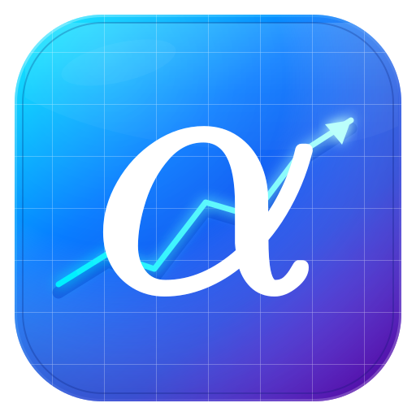
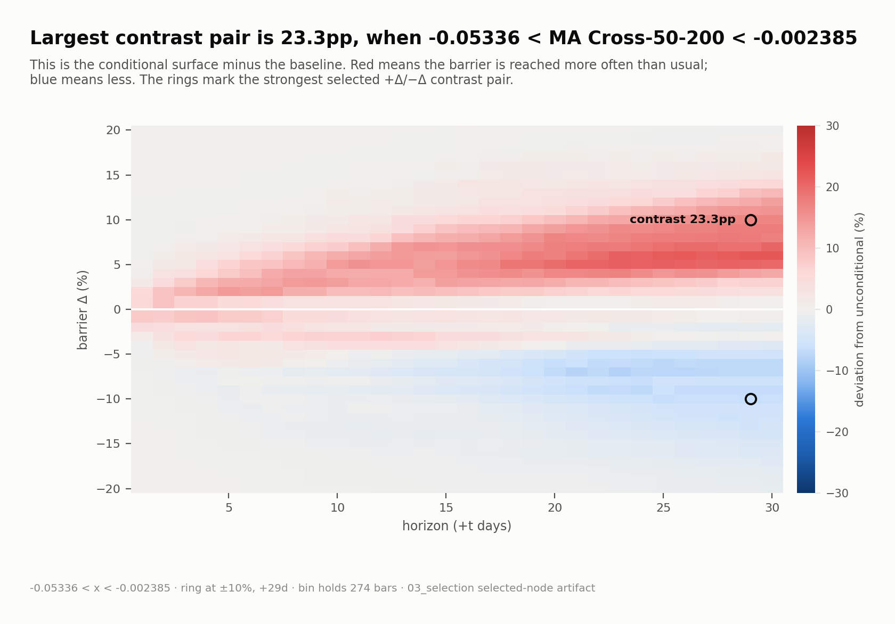
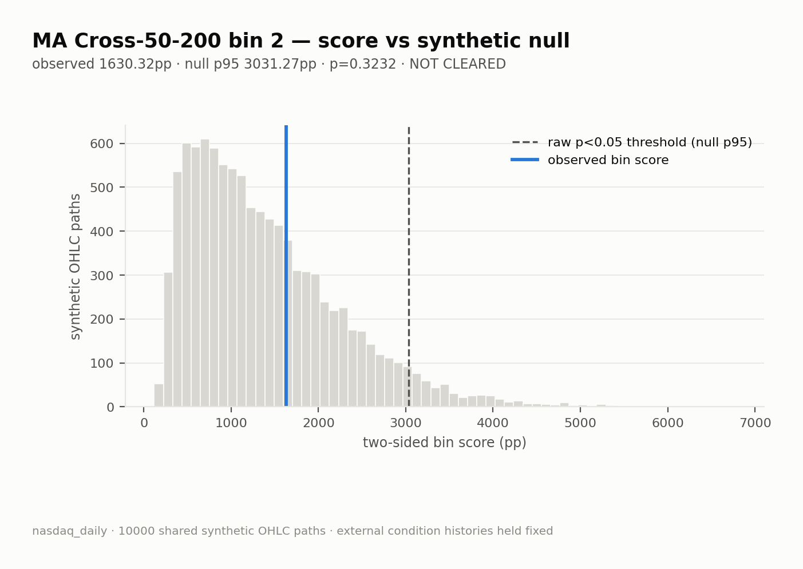

# Alpha Verifier

<div align="center">
  
  <br><br>
  = 3.12">
  = 12.0">
  <br><br>
</div>


**The chart found an edge. We asked whether chance could draw it too.**

You've seen lots of them: a so-called “alpha” strategy and an equity curve that claims to beat the market. They explain the setup, promise there is no future leak, and show that it earns money.

**Most “technical” indicators are essentially astrology with better charts.**

 `alpha-verifier` is built to put an end to all that bullshit.

<p align="center">
<table>
  <tr>
    <td align="center" width="33%"><h2>10,000</h2>random OHLC histories</td>
    <td align="center" width="33%"><h2>19 / 20</h2>20 NASDAQ candidates</td>
    <td align="center" width="33%"><h2>1</h2>raw pass—and not proof of alpha</td>
  </tr>
</table>
<br>
</p>

## Example - MA Cross 50/200

The "MA Cross" heatmap looks decisive: the classic MA Cross 50/200 produces a coherent **23.3 percentage-point** upside/downside contrast. 

<p align="center">
  <a href="docs/selected_shift_surface__008__ma_cross_50_200.png"></a>
</p>

Then the same full-grid score is applied to 10,000 fitted synthetic histories, and it turns out the **decisive edge** is just pure luck.

<p align="center">
  <a href="docs/null_histogram__008__ma_cross_50_200__bin_02.png"></a>
</p>

## Try it

Run commands from the repository root. 

```
python -m pip install -e .

barrierlab measure
barrierlab compare
barrierlab select
barrierlab validate
```

Each pipeline command also accepts `--cuda` when a CUDA-capable PyTorch installation and device are available.

## How it works

| Stage | CLI Command | What it does | Mathematical form |
|---|---|---|---|
| 1 | measure | Measure raw conditional probabilities | `P(price touch Δ within t bars \| condition)` |
| 2 | comapre | Compare raw probabilities to baseline | `P(price touch Δ within t bars \| condition) − P(price touch Δ within t bars)` |
| 3 | select | Select strongest condition effects | `\|shift(+Δ) − shift(−Δ)\| * \|Δ\| / max\|Δ\|` |
| 4 | validate | Validate selected effects vs null | `p < 0.05 or p >= 0.05` |


## Repository map

- [Source architecture](src/README.md) — implementation boundaries, data flow, artifact contracts, and null mechanics.
- [Test contracts](tests/README.md) — what the fast suite protects and what requires a real pipeline run.
- [Workspaces](workspaces/README.md) — experiment declarations, plugins, generated artifacts, and safe workspace changes.

BarrierLab is research software, not investment advice.
