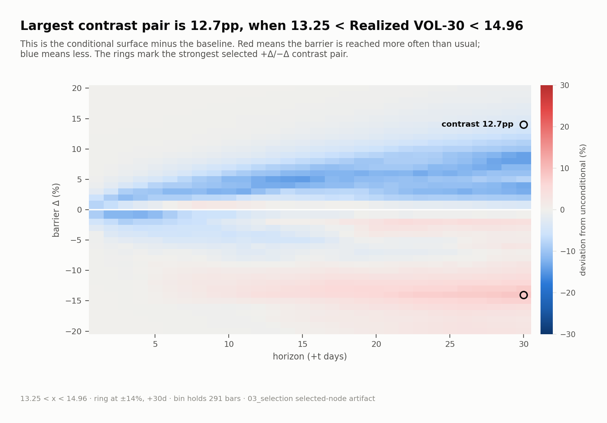
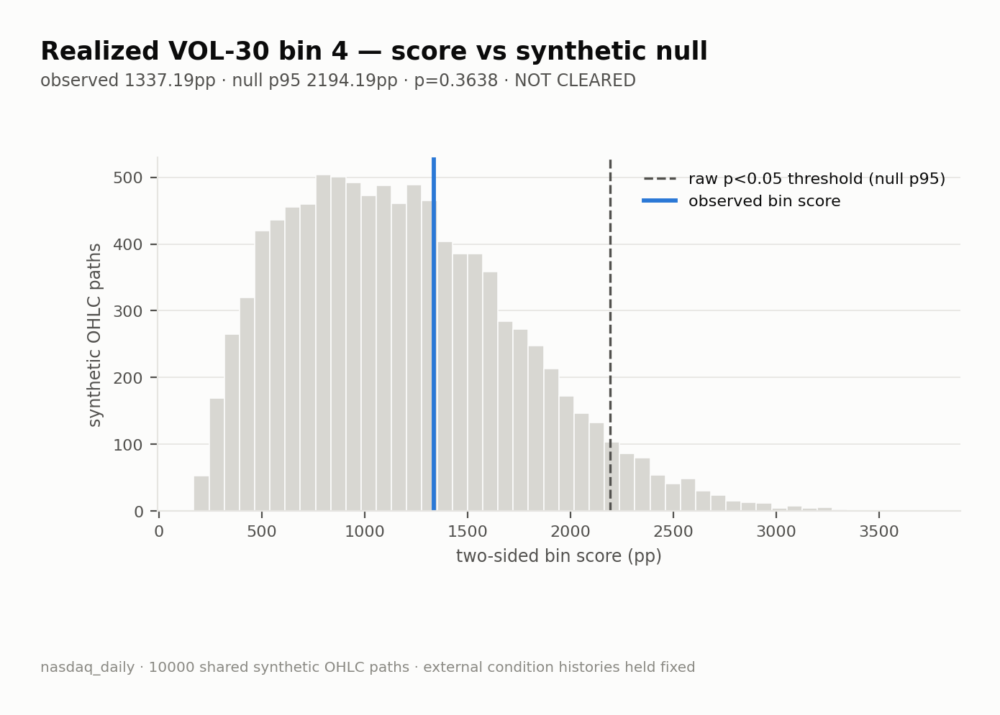

<p align="center">
  <a href="docs/selected_shift_surface__008__ma_cross_50_200.png"></a>
</p>

<h1 align="center">Alpha Verifier</h1>

<p align="center"><strong>The chart found an edge. We asked whether chance could draw it too.</strong></p>

<p align="center">
<table>
  <tr>
    <td align="center" width="33%"><h2>10,000</h2>random OHLC histories</td>
    <td align="center" width="33%"><h2>19 / 20</h2>20 NASDAQ candidates</td>
    <td align="center" width="33%"><h2>1</h2>raw pass—and not proof of alpha</td>
  </tr>
</table>
<br>
</p>

You've seen lots of them: a so-called “alpha” strategy and an equity curve that claims to beat the market. They explain the setup, promise there is no future leak, and show that it earns money.

`alpha-verifier` **is built to put an end to that bullshit.**

We measure how market conditions change the probability of reaching a price level. We find the strongest-looking effects, then ask the harder question: **is the effect actually unusual, or can a market-shaped null manufacture it too?**

> ### In the Nasdaq run, the null manufactured 19 of the top 20.
>
> Nineteen selected condition bins did not clear the synthetic null's 95th percentile. The one raw pass had `p = 0.0443`; because all 20 were selected and tested without a multiple-testing correction, it is a lead for further study—not established alpha.

Most “technical” indicators may be astrology with better charts. This repository makes them face a falsifiable test.

## 01 — The moving-average trap

The hero image looks decisive: the classic MA Cross 50/200 produces a coherent **23.3 percentage-point** upside/downside contrast. Then the same full-grid score is applied to 10,000 fitted synthetic histories.

| What the chart suggests | What the null says |
|---|---|
| Large, coherent conditional structure | `1630.32pp` observed vs `3031.27pp` null p95 |
| A 23.3pp headline contrast | Raw `p = 0.3232` |
| A familiar golden/death-cross story | **Not cleared** |

<p align="center"><sub><strong>THE NULL DISTRIBUTION</strong> · blue is observed · dashed is p95</sub></p>

<p align="center">
  <a href="docs/null_histogram__008__ma_cross_50_200__bin_02.png"></a>
</p>

## 02 — Realized volatility tells the same story

This is not just a moving-average problem. Realized Volatility 30 produces a structured **12.7pp** contrast, but its aggregate score is also ordinary under the fitted null: `1337.19pp` observed versus `2194.19pp` at p95, `p = 0.3638`.

<p align="center"><sub><strong>OBSERVED SURFACE</strong> · conditional barrier-touch probability minus baseline</sub></p>


<p align="center">
  <a href="docs/selected_shift_surface__016__realized_vol_30.png"></a>
</p>

<p align="center"><sub><strong>THE NULL DISTRIBUTION</strong> · a second coherent pattern that does not clear p95</sub></p>

<p align="center">
  <a href="docs/null_histogram__016__realized_vol_30__bin_04.png"></a>
</p>

## The scoreboard

| Selected Nasdaq example | Observed score | Null p95 | Raw p | Verdict |
|---|---:|---:|---:|---|
| MA Cross 50/200, bin 2 | 1630.32pp | 3031.27pp | 0.3232 | not cleared |
| Realized Volatility 30, bin 4 | 1337.19pp | 2194.19pp | 0.3638 | not cleared |

These are two representative condition-bin results, not verdicts on an indicator name as a whole. Several bins from the same indicator can enter the top 20. The complete Nasdaq run retained one raw pass among 20 selected candidates; it is not pictured here and is not treated as established alpha.

## How the verifier works

| 01 — Measure | 02 — Compare | 03 — Select | 04 — Validate |
|---|---|---|---|
| Compute `P(touch Δ by t \| condition)` across the full grid | Subtract the unconditional market baseline | Rank the strongest full-grid condition-bin skews | Compare each winner with 10,000 null scores |
| `01_surface/` | `02_shift/` | `03_selection/` | `04_validation/` |

## Run it

Run commands from the repository root. Python 3.12+ and PyTorch are required; PyTorch is intentionally installed separately so you can choose a CPU or CUDA build.

```powershell
python -m pip install torch
python -m pip install -e .

barrierlab measure  --workspace nasdaq_daily
barrierlab compare  --workspace nasdaq_daily
barrierlab select   --workspace nasdaq_daily
barrierlab validate --workspace nasdaq_daily
barrierlab status   --workspace nasdaq_daily
```

Each pipeline command also accepts `--cuda` when a CUDA-capable PyTorch installation and device are available. `measure` downloads declared market data; `validate` is the compute-heavy stage. Generated arrays, workbooks, plots, and validation JSON stay under the selected workspace and are ignored by Git.

To inspect one measured condition after Stage 2:

```powershell
barrierlab status vix_level --workspace nasdaq_daily
```

## What the result does—and does not—say

This is an adversarial exploratory screen. It demonstrates that large conditional probability shifts can arise under a fitted null and that visual structure alone is weak evidence of alpha.

It does **not** yet establish strategy returns, out-of-sample persistence, causal predictiveness, execution feasibility, or performance after costs. The current null draws independent per-bar log-OHLC vectors from a fitted multivariate Gaussian. It preserves fitted within-bar relationships and history length, but not the observed temporal ordering, volatility regimes, or all market microstructure. Core OHLCV-derived indicators are recomputed on synthetic paths; external, calendar, and workspace-plugin condition histories are held fixed. Validation uses raw `p < 0.05`, without family-wise or false-discovery correction.

## Repository map

- [Source architecture](src/README.md) — implementation boundaries, data flow, artifact contracts, and null mechanics.
- [Test contracts](tests/README.md) — what the fast suite protects and what requires a real pipeline run.
- [Workspaces](workspaces/README.md) — experiment declarations, plugins, generated artifacts, and safe workspace changes.

BarrierLab is research software, not investment advice.
