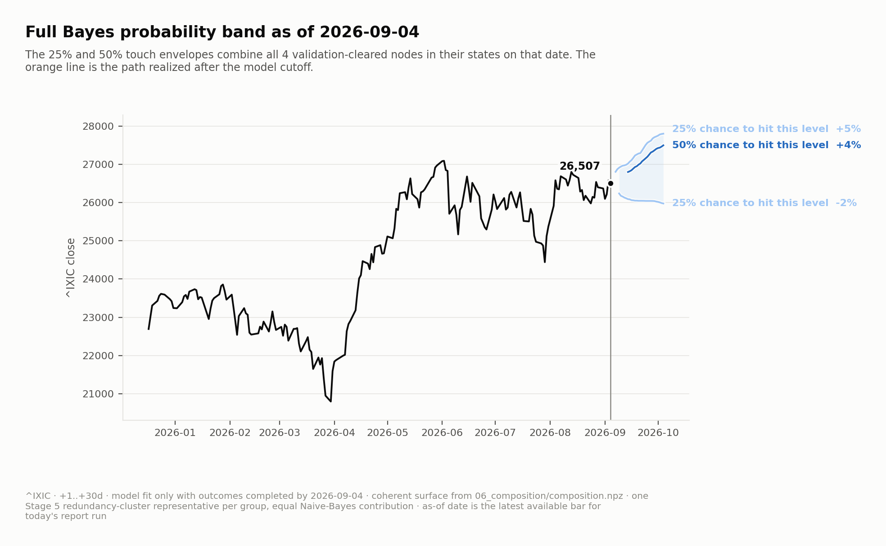

# Conditional Barrier Probabilities

**A reproducible answer to a practical market question: given today’s conditions, how far is price likely to travel before a chosen horizon?**

BarrierLab measures the probability that price *touches* each level—not where it closes—using daily high/low data, conditional feature regimes, an exact circular-shift null, and an out-of-sample composition check. The figure above is the repository evidence image from a `nasdaq_daily` report run, cut off at 2026-09-04; it is evidence of the pipeline’s output, not a forecast guarantee.

## Verify it

```bash
pip install -e .
barrierlab status --workspace nasdaq_daily
```

To reproduce the NASDAQ artifact chain from market data, run the stages in order:

```bash
barrierlab surface --workspace nasdaq_daily
barrierlab shift --workspace nasdaq_daily
barrierlab selection --workspace nasdaq_daily
barrierlab validation --workspace nasdaq_daily
barrierlab redundancy --workspace nasdaq_daily
barrierlab composition --workspace nasdaq_daily
barrierlab report --workspace nasdaq_daily
```

The default workspace is `nasdaq_daily`; use `--workspace btc_daily` for the BTC comparison universe. `barrierlab status <node> --workspace <name>` gives a read-only view of one node’s strongest shift and its available null result.

## What the pipeline establishes

The question is:

```text
P(price touches Δ within t bars | condition bin)
```

The default NASDAQ run measures 58 nodes over a 41-level barrier grid and horizons from +1d through +30d. It only calls a node a cleared finding after all three gates agree:

- its node-wide circular-shift null p-value is at most 0.01;
- it survives Benjamini–Hochberg correction at q = 0.05 across the selected sweep; and
- its representative regime has a stable, material baseline-relative shift.

The current composition evaluation compares an equal-weight, redundancy-clustered Naive-Bayes model with a constant prior. It is an out-of-sample test of whether conditional surfaces compose; it is not a trading strategy or an investment recommendation.

## Read by intent

| If you want to… | Start here |
|---|---|
| Understand the experiment, statistical gates, and artifact formats | [Pipeline protocol](src/barrierlab/pipeline/README.md) |
| Change numerical models, pipeline stages, persistence, report output, or CLI behavior | [Source architecture](src/README.md) |
| Create or modify an asset universe or workspace plugin | [Workspace contract](workspaces/README.md) |
| Check the contracts that prevent architectural or artifact drift | [`tests/`](tests) |

## Limits

- Daily bars reveal the session high and low, but not their intrabar order. Stop-versus-take-profit ordering cannot be inferred from this data.
- Condition-bin counts are observations, not independent trials; long-horizon non-overlap reduces the effective sample size.
- The exact-null p-value floor is `1 / (n + 1)` for `n` usable shifts. On a large sweep, a Bonferroni threshold can be below that floor; the project therefore uses Benjamini–Hochberg FDR for the multi-test gate.
- Data sources and availability matter. The reproducible flagship uses daily Yahoo data; the retired hourly NASDAQ workspace was not reproducible because Yahoo serves only a trailing hourly window.

## Project map

```text
src/barrierlab/        Python package and technical documentation boundaries
workspaces/            versioned experiment declarations and optional plugins
tests/                 contract and regression tests
```

## Data and references

Data comes from [`yfinance`](https://github.com/ranaroussi/yfinance); the BTC workspace additionally uses the [CoinMetrics Community API](https://docs.coinmetrics.io/api/v4). The method references Davison & Hinkley (1997), Benjamini & Hochberg (1995), Platt (1999), White (2000), Lopez de Prado (2018), Politis & Romano (1994), and Karatzas & Shreve (1991). Indicator definitions follow Wilder RSI/ATR, Appel MACD, and Bollinger Bands.
