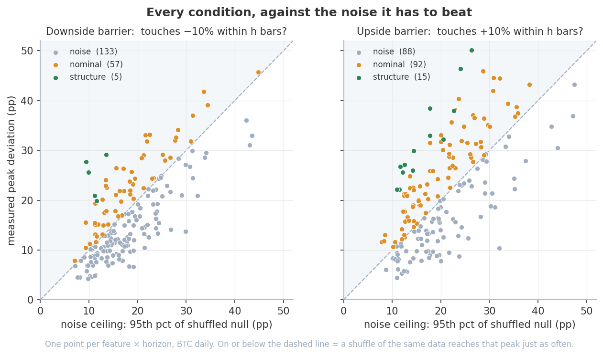
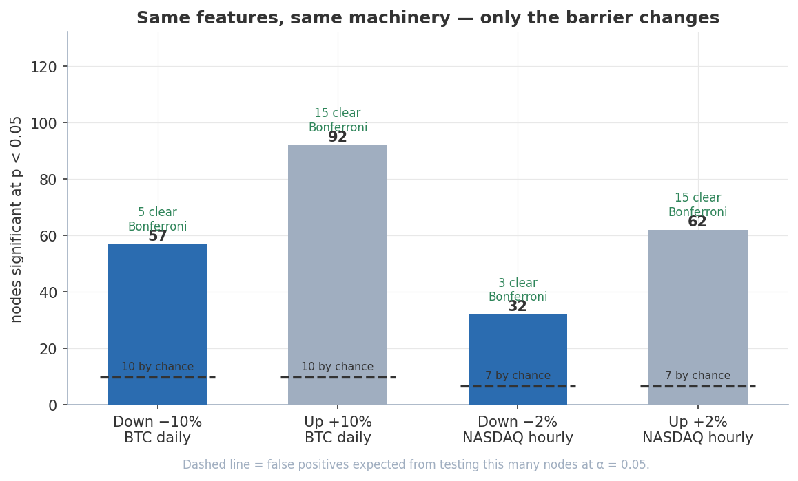
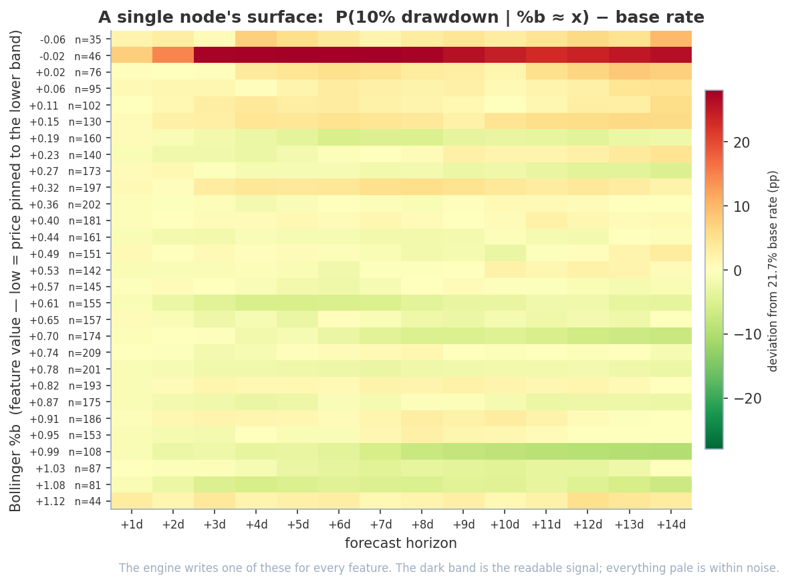
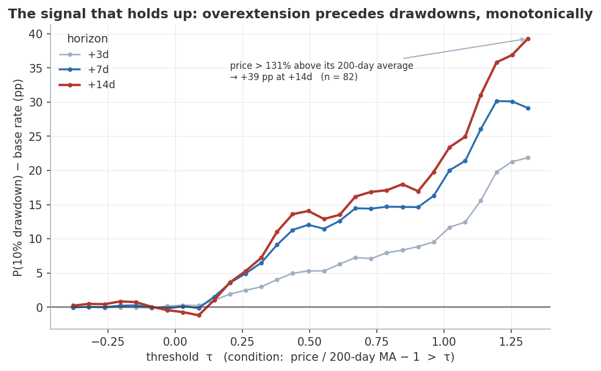
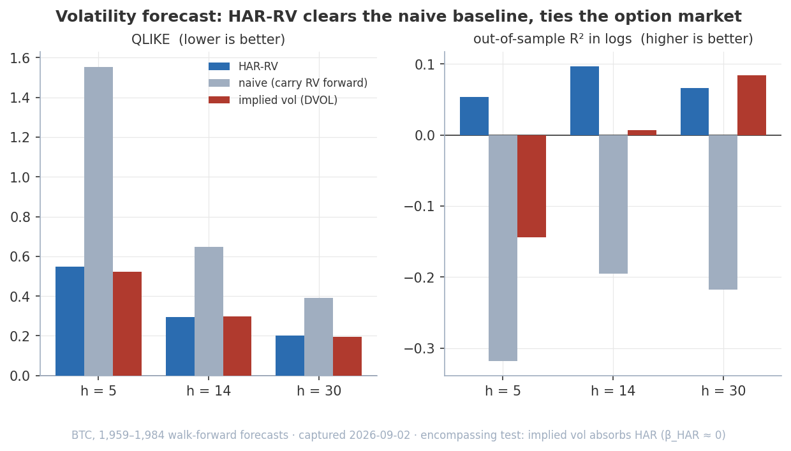

# Empirical Winning-Condition Testing on Any Financial Asset

> Most trading indicators are *asserted*, never measured. This measures them. Point it
> at market **direction** and almost nothing beats a coin flip. Point the same machine
> at **crash risk** and real, mechanical structure shows up.



You declare a universe of **conditions** — each a feature $X$ (RSI, moving-average
deviation, realized volatility, on-chain valuation, time-of-day, …) paired with a
forward horizon $h$ — and an agent drives the pipeline through every one against
history, unattended. For each condition it counts

$$
P\left(\text{outcome} \mid X_t \in \text{condition}\right) - P\left(\text{outcome}\right)
$$

the deviation of the conditional probability from its unconditional base rate. There
is no fitted model and no forecast in the machine-learning sense — only conditional
counting over the historical record, run in batch across hundreds of feature-and-parameter
combinations, with **every headline number falsified against a shuffled null**.

* * *

## What makes this different

- **Indicators become measurements, not rules.** An indicator is taken as a raw
  feature, history is sliced by its value, and the edge is reported as a deviation
  from the base rate at each horizon — a number, with a sample size, not a backtested
  strategy with a curve to overfit.
- **Falsification is built in.** A node's headline is a *maximum* over ~30 threshold
  bins, which is biased upward even for a feature that carries nothing. `--validate`
  builds the null distribution of that exact statistic by circularly shifting the
  outcome against the feature, then reads the real value as a quantile of it and
  corrects for the size of the search.
- **The outcome is pluggable.** The same conditional-counting machinery answers
  "does price rise?", "does it fall 10% first?", or "does realized volatility spike?"
  — swap one registry entry, keep every feature.
- **Batch, unattended, reproducible.** Add a `universe.json`, walk away, come back to
  65 surfaces and a structured verdict per family. `python run.py --charts` regenerates
  every figure in this README from files already in the repo, no data fetch.

* * *

## Results at a glance

Everything below is reported **against the null**, not against a fixed threshold. For
this universe the null median of a node's peak statistic is ~10 pp at +3d and ~17 pp
at +14d — the same magnitude as most "edges" a naive read would report.

### Direction is not predictable — in either market

| Workspace | Tests | `structure` (clears Bonferroni) | `nominal` (p < 0.05) | Expected by chance |
|-----------|-------|---------------------------------|----------------------|--------------------|
| `btc_daily_14days` | 195 | **0** | 14 | 9.8 |
| `nasdaq_hourly_24hrs` | 132 | **0** | 5 | 6.6 |

Nothing survives correction in either. Bitcoin's 14 nominal hits against 9.8 expected
is the excess a search this wide produces from noise alone; the NASDAQ scan returns
*fewer* nominal hits than chance would give. The former headline signals — deep on-chain
undervaluation (MVRV), the halving cycle — sit **below their own null's 95th percentile**
once you account for how slowly they move.



### The same features carry real information about crash risk

Re-aim the identical 65 nodes at `--outcome drawdown --threshold 0.10` (a 10%
peak-to-trough loss from $t$ within $h$ bars), same history, same 39,000 shifts, same
$\alpha = 2.56 \times 10^{-4}$, and the picture inverts: **4 nodes clear Bonferroni
outright and 58 reach nominal significance** — a 5.9× excess over chance, with
p-values three to four orders of magnitude smaller than anything on the direction side.



Every feature produces a surface like this. The readable band here is price pinned to
the lower Bollinger — elevated 10% drawdown risk across every horizon — against a pale
(within-noise) background everywhere else.



The strongest single condition is monotone and large: price more than ~130% above its
200-day moving average precedes a 10% drawdown within 14 days at **+39 pp over a 21.7%
base rate** ($n = 82$), rising at every threshold beneath it. What carries the drawdown
signal is volatility position, recent drawdown itself, and trend structure —
volatility clustering and the leverage effect, both well documented, neither
arbitraged away.

### Reading the two together

The same features, machinery and history carry **no usable information about whether
price rises**, and **substantial information about whether it falls hard**. That is the
expected shape, not a surprise: direction is the most competed-away quantity in a
liquid market, while tail risk is driven by mechanisms that persist precisely because
they are not arbitrageable in the same way.

Two caveats bound the risk result:

1. **The null is conservative here.** Circular shifting preserves each series'
   autocorrelation but not the joint regime structure; where both series share a slow
   regime component — as they do for crash risk — this inflates the null, so the
   drawdown result is if anything understated. A block bootstrap would tighten it.
2. **Significance is not tradability.** These are in-sample conditional probabilities
   over the full history, not a walk-forward backtest with costs.
   [`research/drawdown_overlay/`](research/drawdown_overlay/) follows the four
   Bonferroni-clearing nodes all the way to an equity curve with discrete,
   horizon-matched trades and costs: trigger bars are *weak* but not *negative*,
   so shorting the signal never gets ahead of BTC's drift — while holding *flat*
   over the same windows beats buy-and-hold on risk-adjusted terms in and out of
   sample (walk-forward Calmar 1.1 vs 0.7, max drawdown ~83% → ~64%). A real
   p-value bought a risk overlay, not a return engine.

* * *

## Extension — forecasting realized volatility

The conditional-winrate engine measures *probabilities of events*. A separate module
(`engine/harrv.py`, `--volforecast`) applies the same "beat an honest benchmark or
it's nothing" discipline to a *level* forecast: next-$h$-bar realized volatility.



Three forecasters compete on the same target: **HAR-RV** (Corsi 2009, fit in logs
with a Jensen correction, walk-forward with an embargo), **naive** persistence of
trailing RV, and the **option market's own** implied vol (Deribit DVOL). Scoring is
QLIKE — the loss that stays consistent when the target is a noisy proxy (Patton 2011)
— alongside out-of-sample $R^2$. HAR-RV clears the naive baseline comfortably at every
horizon, roughly ties implied vol, and an encompassing regression shows implied vol
absorbs it ($\beta_{\mathrm{HAR}} \approx 0$): accurate, but not a trade once the
variance risk premium is paid away. Same lesson as the direction scan, on a different
question.

* * *

## Try it on your own asset

A workspace is one asset + one sampling interval + its feature universe. Adding one
requires **no changes to root code**.

```bash
pip install -r requirements.txt

# 1. drop in workspaces/<name>/universe.json  (asset, horizons, feature families)
python run.py --workspace <name> --status         # inventory
python run.py --workspace <name> --family rsi      # compute a family of surfaces
python run.py --workspace <name> --read rsi_14     # inspect one
python run.py --workspace <name> --validate        # shuffle-null every tested node
python run.py --workspace <name> --findings        # structured verdict per family
```

A **cross-asset feature** (any OHLCV series) is registered in `data/features.py`:

```python
def _my_feature(close: pd.Series, period: int) -> pd.Series:
    ...

register('my_feature', lambda d, p: _my_feature(d['close'], p['period']))
```

A **workspace-specific feature or data source** (on-chain metric, options IV, custom
API) goes in `workspaces/<name>/plugin.py`, imported automatically when the workspace
loads:

```python
from data import features, fetcher

def _my_source(start: str, asset: dict) -> pd.DataFrame:   # DatetimeIndex-ed frame
    ...

fetcher.register_source('my_source', _my_source)
```

Outcomes are a registry too — `outcomes.register(...)` at import time aims the whole
pipeline at a different event with no root edits.

* * *

## How it works

### 1. Base rate

For a horizon $h$ (in bars), the outcome at time $t$ is an indicator such as
$\mathbb{1}[\text{close}_{t+h} > \text{close}_t]$. The unconditional **base rate** is
its historical mean $p_0(h)$. Rows with $n < 20$ are undefined; the last $h$ bars of
every horizon's sample have no realized outcome and are dropped.

### 2. Conditional surface (CDF) and local recovery (PDF)

A node computes a feature series $X_t$, then evaluates 30 thresholds spanning its
2nd–98th empirical percentiles. For each threshold $x$ and horizon $h$ it records two
cumulative deviations:

$$
\Delta_{>}(x, h) = P\left(\text{outcome} \mid X_t > x\right) - p_0(h),
\qquad
\Delta_{<}(x, h) = P\left(\text{outcome} \mid X_t < x\right) - p_0(h)
$$

These are the CDF of the outcome in the feature. Differencing adjacent cumulative rows
recovers the **local** (PDF) edge — the deviation for observations whose feature value
falls *within* an interval — from which the combiner interpolates the edge at any
current feature value. Each node is written as an `.xlsx` with three colour-scaled
tabs (PDF, CDF-above, CDF-below); green = bullish edge, red = bearish. Observation
counts report the longest-horizon (most conservative) count.

### 3. Signal combination — Naive Bayes in log-odds

`--probe` selects the single node per family with the highest peak absolute deviation
at the pivot horizon (subject to $n \geq 30$ slices), then combines the survivors in
log-odds space. Assuming conditional independence given the outcome,

$$
\mathrm{logit}\,p_\mathrm{comb}(h) = \mathrm{logit}\,p_0(h) + \sum_i w_i \left[ \mathrm{logit}\left(p_0(h) + \delta_i(h)\right) - \mathrm{logit}\,p_0(h) \right]
$$

where $\delta_i(h)$ is family $i$'s local deviation at the current feature value. The
independence assumption is deliberately optimistic — correlated signals inflate the
combined edge — and the tool flags it. Thin slices are shrunk toward zero with a CLT
floor at $n_0 = 30$ and half-weight scale $N_0 = 50$:

$$
w(n) = \begin{cases}
0 & n < 30 \\
\frac{n - 30}{(n - 30) + 50} & n \geq 30
\end{cases}
$$

### 4. Shuffle-null validation

A node's peak absolute deviation across ~30 bins is a **maximum over many noisy
estimates**, biased upward even when the feature carries nothing: with $n \approx 50$
per bin the standard error of a rate is $\sqrt{0.25/50} \approx 7$ pp, and the max
over 30 such bins lands near 10 pp by construction. Comparing a peak against a fixed
pp threshold measures how many bins were searched, not whether there is signal.

`--validate` builds the null of that same statistic directly. The outcome series is
circularly shifted against the feature many times; each shift preserves the
autocorrelation of both series — which matters, because overlapping $h$-bar outcomes
are strongly serially correlated — while destroying any real alignment. The real peak
is read as a quantile of that null:

$$
p = \frac{1 + \mathrm{count}\left(\text{shift peak} \geq \text{real peak}\right)}{1 + n_\mathrm{shifts}}
$$

The add-one estimator (Davison & Hinkley) keeps $p$ strictly positive; its floor,
$1/(n_\mathrm{shifts}+1)$, is also the resolution limit, so a sweep of $k$ tests needs a
Bonferroni $\alpha/k$ and nothing below the floor can be resolved.

| Verdict | Meaning |
|---------|---------|
| `structure` | Clears $\alpha/k$; survives correction for the size of the search |
| `nominal` | Clears $\alpha$ alone — what a single-node view would call an edge |
| `underpowered` | Sits at the resolution floor; might clear $\alpha/k$, but this many shifts cannot show it |
| `noise` | Indistinguishable from the null |

Results are written to `validation.json` (or `validation.<event>.json` for a
non-default outcome). Re-running with `--families` **merges** into that file, and the
Bonferroni denominator is taken over every test the file contains.

### 5. Pluggable outcomes

| `--outcome` | Event | Default base rate (BTC, +14d) |
|-------------|-------|-------------------------------|
| `up` | $\text{close}_{t+h} > \text{close}_t$ — the default | 56.5% |
| `drawdown` | $\min(\text{close}_{t+1..t+h}) / \text{close}_t - 1 < -\theta$ — a peak-to-trough loss | 21.7% ($\theta = 0.10$) |
| `runup` | Mirror of `drawdown`: a gain exceeding $+\theta$ at any point within $h$ | — |
| `vol_high` | Realized volatility over $(t, t+h]$ exceeded its own trailing (backward-looking) median | 47.4% |

Node status (`pending` / `tested`) tracks the **default outcome only**. Any other
outcome writes to a per-event subdirectory (`<family>/dd10/<node>.xlsx`) and leaves
node status untouched, so no two outcomes overwrite each other.

* * *

## Repository layout

```
run.py               ← thin CLI dispatcher
workspace.py         ← Workspace class; loads universe.json + optional plugin
data/
  features.py        ← FeatureRegistry: register() / compute()
  fetcher.py         ← SourceRegistry:  register_source() / fetch()
engine/
  matrix.py          ← base rate + conditional CDF surfaces
  outcomes.py        ← OutcomeRegistry: the event being measured (up / drawdown / vol)
  writer.py          ← xlsx rendering, colour scales, PDF recovery
  combiner.py        ← Naive Bayes log-odds combination + shrinkage
  validate.py        ← circular-shift null test + Bonferroni verdicts
  harrv.py           ← HAR-RV volatility forecast vs naive RV vs implied vol
  charts.py          ← regenerates the README figures from committed data
tree/
  tree.py            ← node traversal over universe.json
workspaces/
  <name>/
    universe.json    ← asset, horizons, feature families, all config
    plugin.py        ← (optional) custom features and data sources
    findings.json    ← structured per-family verdicts, written by --findings
    validation.json  ← per-node null-test p-values and verdicts, written by --validate
assets/              ← README figures + captured volforecast scores
```

Root code owns the stable engine contracts; each workspace owns everything specific to
its asset. Both the feature layer and the data-source layer are registries.

* * *

## CLI reference

All commands take `--workspace <name>` (default `btc_daily_14days`):

| Command | Stage | Output |
|---------|-------|--------|
| `--status` / `--list` | Inventory | Pending / tested / skipped per family |
| `--next` / `--family <name>` / `--node <id>` | Compute | Runs nodes → writes `.xlsx` surfaces |
| `--regen` | Compute | Regenerates `.xlsx` without changing node status |
| `--read <id>` | Inspect | Prints significant rows from a node's surface |
| `--probe` | Combine | Current combined estimate — best node per family, Naive Bayes |
| `--backtest` | Validate | Walk-forward directional accuracy, bucketed by model edge |
| `--findings` | Report | Writes `findings.json` — structured verdict per family |
| `--validate` | Falsify | Shuffle-null test of every tested node; writes `validation.json` |
| `--volforecast` | Extension | HAR-RV vs naive RV vs implied vol on the workspace asset |
| `--charts` | Report | Regenerates `assets/` figures from committed data |

`--families a,b,c` narrows `--probe` / `--backtest` / `--validate` to a subset.
`--outcome <name>` (with `--threshold` where applicable) re-aims any command at a
different event; `--shifts N` sets the resampling depth for `--validate`;
`--vol-horizons H,...` sets the horizons for `--volforecast`.

* * *

## Workspaces

| Workspace | Asset | Interval | Horizons | History | Extras |
|-----------|-------|----------|----------|---------|--------|
| `btc_daily_14days` | BTC-USD | 1d | +1…+14 d | from 2015 | CoinMetrics on-chain, halving-cycle features, Deribit DVOL |
| `nasdaq_hourly_24hrs` | ^IXIC | 1h | +1…+24 h | trailing ~730 d | VIX / treasury cross-asset, time-of-day |

A workspace is defined entirely by `universe.json` (`meta` + `families`). Key `meta`
fields: `asset` `{provider, ticker, interval}`, `horizons`, `start_date`,
`n_thresholds`, `display_horizons`, `sample_freq`, `min_obs`, and `outcome`
`{name, params}`.

### Built-in data sources

| Source key | Provider | Columns |
|------------|----------|---------|
| `ohlcv` | yfinance (workspace asset + interval) | open, high, low, close, volume |
| `vix` | yfinance `^VIX` | vix |
| `treasury` | yfinance `^TNX` | tnx |
| `dxy` | yfinance `DX-Y.NYB` (daily) | dxy |
| `coinmetrics` | CoinMetrics community API *(btc plugin)* | mvrv, hash_rate, adr_act_cnt, tx_cnt |
| `dvol` | Deribit volatility-index API *(btc plugin)* | dvol |

* * *

## References

**Data sources**
- Yahoo Finance via [`yfinance`](https://github.com/ranaroussi/yfinance) — OHLCV, VIX, 10-year treasury yield, US dollar index
- [CoinMetrics Community API](https://docs.coinmetrics.io/api/v4) — Bitcoin on-chain metrics (MVRV, hash rate, active addresses)
- [Deribit API](https://docs.deribit.com/) — DVOL, the BTC 30-day implied-volatility index

**Statistical methods**
- Naive Bayes and the conditional-independence assumption — Hand & Yu (2001), *Idiot's Bayes — Not So Stupid After All?*, International Statistical Review 69(3)
- Log-odds additivity of evidence — Good (1950), *Probability and the Weighing of Evidence*
- Shrinkage / partial pooling of small-sample rates — Efron & Morris (1975), *Data Analysis Using Stein's Estimator and Its Generalizations*, JASA 70(350)
- Add-one permutation p-values and resampling resolution — Davison & Hinkley (1997), *Bootstrap Methods and Their Application*, CUP, §4.2
- Resampling that preserves serial dependence — Politis & Romano (1994), *The Stationary Bootstrap*, JASA 89(428)
- Multiple testing over a searched universe of rules — White (2000), *A Reality Check for Data Snooping*, Econometrica 68(5)

**Volatility forecasting**
- Corsi (2009), *A Simple Approximate Long-Memory Model of Realized Volatility*, Journal of Financial Econometrics 7(2) — HAR-RV
- Patton (2011), *Volatility Forecast Comparison Using Imperfect Volatility Proxies*, Journal of Econometrics 160(1) — QLIKE robustness

**Technical indicators**
- Wilder (1978), *New Concepts in Technical Trading Systems* — RSI, ATR
- Appel (2005), *Technical Analysis: Power Tools for Active Investors* — MACD
- Bollinger (2001), *Bollinger on Bollinger Bands*
