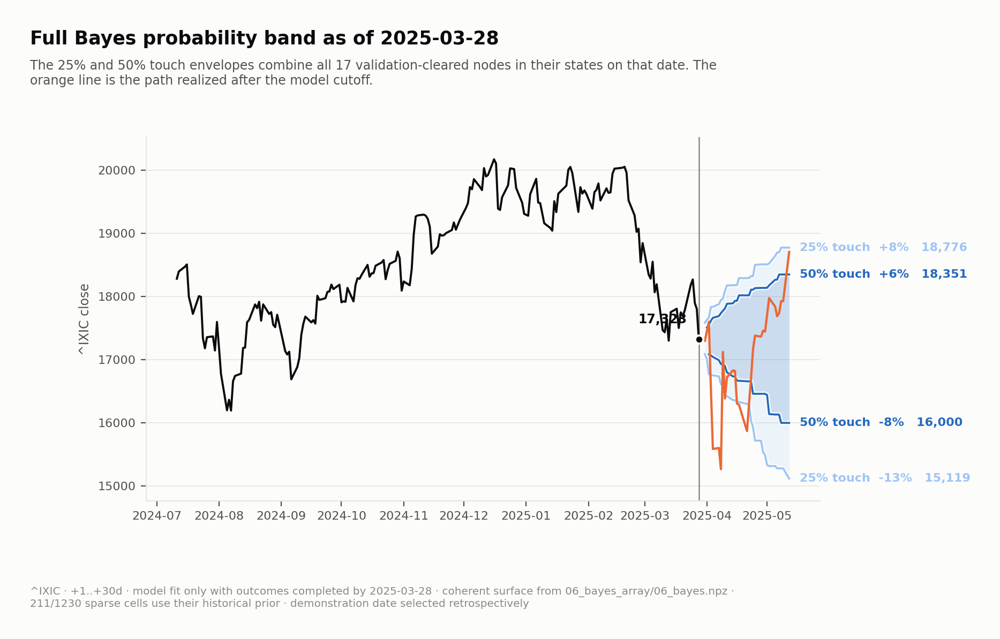
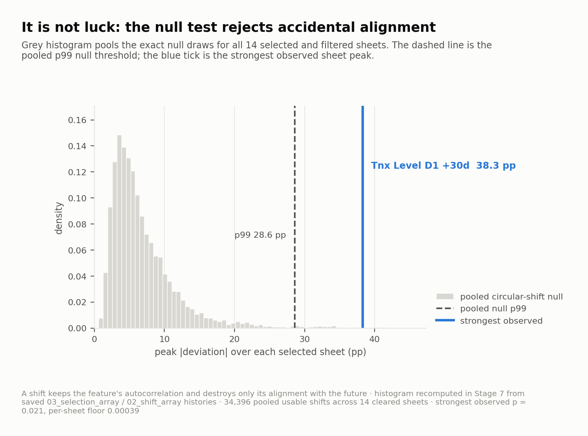

# Conditional Barrier Probabilities

**Not "where will price close later?" - "did price ever reach this level?"** Stops,
limits, margin calls and liquidations all turn on a barrier touch, not a closing print.
This pipeline measures that question across barrier levels, condition bins and forward
horizons, using high/low extremes and an exact shuffled null.

The flagship workspace is now `nasdaq_daily`: a reproducible daily NASDAQ
Composite run from 2015-01-01, with a 30-session horizon ladder and a barrier grid scaled
for equity-index moves.



The figure above inverts the measured cube into the form people actually use: given the
condition the index is in on the latest bar, how wide are the historical 25% and 50%
touch envelopes? Both bands use the current condition bin, so the current regime is
visible directly on the price axis.

Every node is judged against the two filters that decide whether it clears: practical
effect size and shuffled-null strength. The useful result is the cleared-both set:
conditions that are large enough to matter and too strong to explain as alignment noise.

## What It Found

| | `nasdaq_daily` | `btc_daily` |
|---|--:|--:|
| Nodes measured | 58 | 66 |
| Null tests (node x horizon) | 406 | 462 |
| Economically usable | 53 | 55 |
| Nodes with a BH discovery | 53 | 51 |
| **Cleared both** | **51** | **50** |

Three findings carry the front page.

**1. Barrier probability is widely predictable.** On NASDAQ daily, 51 of 58 nodes clear
both the economic filter and the shuffled-null gate. The strongest cleared cells are not
all one-bar artifacts: the peak horizons are +2d for 13 nodes, +7d for 12, +1d for 10,
and +30d for 7.

**2. The filters are strict enough to be useful.** A condition has to pass an economic
threshold and a shuffled-null test corrected across the sweep. The point is not a large
spreadsheet of indicators; it is a short list of conditional barrier claims that survived
both gates.

**3. Cross-asset regimes matter, but they are still magnitude regimes.** VIX, Treasury
yield and DXY features join price, volatility and trend features in the discovery set.
The report keeps the exact null diagnostics front and center, then renders one
conditional-shift surface for every node that cleared both.

## Why The Numbers Are Trustworthy

### The Null Is Exact

Writing `counts[Δ, bin]` as a function of circular shift makes it a
cross-correlation between the touch indicator and the bin-membership mask. One FFT yields
every shift at once, returning the full permutation distribution rather than a resampled
approximation.



The finest obtainable p-value is `1/(n+1)`. For the NASDAQ daily run that floor is
`3.95e-4`; with 406 tests, Bonferroni at `alpha=0.05` would require `1.23e-4`, which is
below the floor. The gate therefore controls false discovery rate with
Benjamini-Hochberg instead of exposing an unusable family-wise threshold.

### Two Filters Are Required

The economic filter requires a deviation of at least 10 percentage points, in a bin with
at least 50 observations, across at least two adjacent barrier rows with the same sign.
The statistical filter requires the surface peak to clear the shuffled null after
correction across the sweep. Neither filter alone is treated as a claim.

### The Baseline Is A Node

`baseline` is measured like any other node. Its single condition bin is the unconditional
touch probability surface, and every conditional node has to beat that reference. This
keeps the pipeline uniform and prevents special-case arithmetic from drifting away from
the artifacts.

## Do Conditions Compose?

Under conditional independence, log-odds contributions add, and every term already lives
in a cube cell:

```text
logit P(touch | x1..xk)
  = logit P(touch) + sum_i [logit P(touch | xi) - logit P(touch)]
```

Stage 6 tests that composition out of sample. Bin edges, per-bin rates, the prior and
the scale correction are all fit on an expanding training window, then applied to later
bars with a 30-session embargo and non-overlapping scoring.

| model | Brier down | AUC | vs. prior |
|---|--:|--:|--:|
| constant prior | 0.214 | - | - |
| naive Bayes, all selected nodes | 0.231 | 0.619 | +8.1% worse |
| one node per family | 0.235 | 0.460 | +9.9% worse |
| + scale corrected | 0.228 | 0.430 | +6.6% worse |

The raw model is overconfident because correlated indicators count similar evidence many
times. For the headline target, `P(touch -7% within 30d)`, both the family reduction
and Platt correction still trail the constant prior out of sample. That result is useful:
the single-condition measurements do not automatically compose into a better forecast.

Across the complete composition sweep, 458 of 1,200 barrier/horizon targets beat the
prior after correction. The sweep includes rare-event targets, so its extreme AUC cells
are diagnostics rather than headline claims; inspect realized rates and scored counts in
`06_bayes.json` before interpreting any individual cell.

## Run It

```bash
pip install -e .

volatility-matrix --surface        # 1. write 01_surface_array and 01_surface_xlsx
volatility-matrix --shift          # 2. write 02_shift_array and 02_shift_xlsx
volatility-matrix --selection      # 3. write 03_selection_array and 03_selection_xlsx
volatility-matrix --validation     # 4. write 04_validation_array and 04_validation_xlsx
volatility-matrix --gate           # 5. BH correction and selected-sheet economic intersect
volatility-matrix --bayes          # 6. walk-forward composition
volatility-matrix --report         # 7. render workspaces/nasdaq_daily/result

volatility-matrix --status
volatility-matrix --read vix_level
```

`volatility-matrix` defaults to `nasdaq_daily`. Pass `--workspace btc_daily` to rerun
the BTC comparison workspace. `--family <name>` restricts a stage, `--rerun` rebuilds
existing artifacts, and `--fdr Q` sets the Benjamini-Hochberg rate used by `--gate`.

### What Lands On Disk

```text
workspaces/<name>/
  01_surface_array/<family>/<node>.npz              compute  full Δ x bins x horizons
  01_surface_xlsx/<family>/<node>.xlsx          view     full cube workbook
  02_shift_array/<family>/<node>.npz        compute  full baseline-subtracted shift cube
  02_shift_xlsx/<family>/<node>.xlsx    view     red/blue shift workbook
  03_selection_array/selection.json         compute  ranking index for selected sheets
  03_selection_array/<family>/rank_*.npz    compute  copied selected shift sheet arrays
  03_selection_xlsx/<family>/rank_*.xlsx    view     selected shift sheet workbook
  04_validation_array/<family>/<node>.npz         compute  exact shuffled null
  04_validation_xlsx/<family>/<node>.xlsx   view     readable validation sheet
  05_gate.json  06_bayes.npz  06_bayes.json
                                                   verdicts and composition metrics
workspaces/<name>/result/*.png                                report figures
```

The `.npz` arrays are tracked because they are the measurement record. Rendered `.xlsx`
workbooks are ignored: they are regenerated by `--surface`, `--shift`, and `--validation`.

## Limits

**Sample size.** A decile condition on ten years of daily bars has only a few hundred
bars, and far fewer non-overlapping windows at long horizons. Counts are bar counts, not
independent-trial counts.

**Bar resolution.** Daily OHLC records the session high and low, not which came first.
Questions that depend on the order of a stop and take-profit inside the same daily bar
are not answerable from daily data.

**Hourly reproducibility.** The old `nasdaq_hourly_24hrs` workspace was removed because
Yahoo only serves a trailing hourly window. The daily NASDAQ workspace is reproducible
across time in a way the hourly one was not.

## References

**Data** - [`yfinance`](https://github.com/ranaroussi/yfinance) and
[CoinMetrics Community API](https://docs.coinmetrics.io/api/v4)

**Method** - Davison & Hinkley (1997), Benjamini & Hochberg (1995), Platt (1999),
White (2000), Lopez de Prado (2018), Politis & Romano (1994), and Karatzas & Shreve
(1991). Indicator definitions follow Wilder RSI/ATR, Appel MACD and Bollinger Bands.

See [METHOD.md](METHOD.md) for the artifact formats, stage-by-stage procedure
and extension points.
