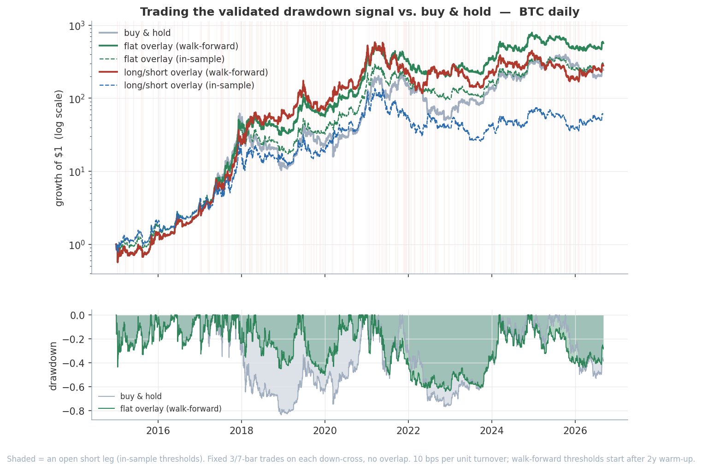

# Trading the validated drawdown signal

*Regenerate with `python research/drawdown_overlay/simulate.py`. Window
2015-01-01 to 2026-09-02, 4,263 BTC daily bars
(live yfinance pull — the last bar and the exact figures move a little between runs).*

Four nodes clear Bonferroni on the 10%-drawdown outcome in
[`validation.dd10.json`](../../workspaces/btc_daily_14days/validation.dd10.json):
`bb_pct_20` at +3d and +7d, `drawdown_7` at +3d, `ma_cross_7_21` at +3d — three
distinct features, all firing on their low tail (price at the lower Bollinger
band, a deep trailing drawdown, the fast MA below the slow one). This asks the
question the main README defers: **is that edge worth trading?**

## The rule  (discrete, event-based)

Default position is **long BTC (+1)**. A feature *triggers* on a **down-cross** of
its p10 (bottom-decile) threshold — at or above it last bar, below it
now. Each trigger opens one fixed-length short of exactly the node's validated
horizon (`bb_pct_20` 7b, `drawdown_7` 3b, `ma_cross_7_21` 3b), which then closes; a feature is not re-armed until it has
climbed back above its threshold, and triggers arriving while its leg is still
open are ignored. The overlay is risk-off whenever **any** of the three legs is
open. Two risk-off stances — **short (−1)** and **flat (0)** — and two threshold
regimes:

| | threshold | honest? |
|---|---|---|
| **IS** | each feature's p10 over the whole history | no — the nodes were *selected* on this same history |
| **WF** | expanding p10, past data only, after a 2y warm-up | yes — fully causal |

Costs: 10 bps per unit of turnover, so a long→short flip pays 20 bps.
(A "stay short while the feature is in its low zone" construction was tried and
dropped — it holds the overlay short far too often and dilutes the edge.)

## Results

| variant | total return | CAGR | ann vol | Sharpe | max drawdown | Calmar |
|---|--:|--:|--:|--:|--:|--:|
| buy & hold | 24,294% | 60.1% | 66% | 1.04 | -83% | 0.72 |
| flat overlay — IS | 29,179% | 62.6% | 54% | 1.17 | -68% | 0.93 |
| flat overlay — walk-forward | 56,776% | 72.2% | 55% | 1.26 | -64% | 1.13 |
| long/short overlay — IS | 5,791% | 41.8% | 66% | 0.86 | -81% | 0.52 |
| long/short, needs ≥2 legs open — IS | 32,431% | 64.1% | 66% | 1.08 | -67% | 0.96 |
| long/short overlay — walk-forward | 27,852% | 62.0% | 66% | 1.06 | -80% | 0.77 |

## Does the premise hold?

The nodes predict drawdown *probability*, not negative *expected return* — and
BTC's unconditional drift is large and positive (60% CAGR).

- **269** trades in-sample, **224** walk-forward;
  a short leg is open on **23%** of all bars.
- Forward 1-bar return **+0.046%** on trigger bars vs
  **+0.232%** elsewhere — the trigger does not
  pick out negative expected return, so a short has nothing to work with.
- Realized 10%-within-14d drawdown frequency: **22%** overall
  vs **28%** on trigger bars — the signal
  concentrates drawdown risk.

## Verdict

**Shorting doesn't earn its keep.** Trigger bars carry a *lower* forward return
than average (+0.046% vs +0.232%) —
but still positive: the signal marks *weak* days, not *down* days. So the
long/short overlay is behind buy & hold in-sample (42% CAGR)
and a wash with it walk-forward (62% vs 60% CAGR,
similar drawdown). The 60%-a-year drift swamps the edge either way.

**Sidestepping the drawdowns is the result.** Holding *flat* rather than short
over the same windows beats buy & hold on risk-adjusted terms in both regimes, and
walk-forward on outright return too: 72% CAGR at Calmar
1.13 vs 0.72, with the max drawdown cut from
83% to 64%. On ~224
trades over one asset and one path, read that as encouraging, not proven.

A Bonferroni-clearing p-value bought a risk-management overlay — not a return
engine. The gap between *significant* and *tradable* is the whole point of the
parent project.
