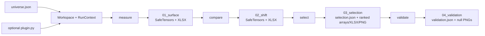

# Source architecture

`src/` owns the installable `barrierlab` package: numerical definitions, data and artifact adapters, pipeline orchestration, presentation, and the command-line entrypoint. It does not own asset-specific experiments—the declarations and optional extensions for those live in [`workspaces/`](../workspaces/README.md)—or the evidence narrative in the [root README](../README.md).

## Public entrypoints

| Entrypoint | Responsibility |
|---|---|
| `barrierlab.cli:main` | Installed `barrierlab` command and argument routing |
| `barrierlab.infrastructure.workspace.Workspace` | Validated view of one `universe.json` and its artifact namespace |
| `barrierlab.pipeline.step_01_surface.cmd_surface` | Stage 1 `measure` implementation |
| `barrierlab.pipeline.step_02_shift.cmd_shift` | Stage 2 `compare` implementation |
| `barrierlab.pipeline.step_03_selection.cmd_selection` | Stage 3 `select` implementation |
| `barrierlab.pipeline.step_04_validation.cmd_validation` | Stage 4 `validate` implementation |
| `barrierlab.pipeline.status.cmd_status` | Read-only workspace and node inspection |

The CLI constructs `Workspace(args.workspace)` relative to `Path.cwd() / "workspaces"`; run it from the repository root unless calling the Python API with an explicit workspace directory.

## Package boundaries

```text
src/barrierlab/
  cli.py              command definitions and dispatch
  domain/             numerical and statistical rules
  infrastructure/     workspace, source, plugin, and persistence adapters
  pipeline/           stage orchestration and status reporting
  presentation/       XLSX and PNG views of existing artifacts
```

### `domain/`

Owns barrier-touch calculations, feature transforms, baseline subtraction, selection scoring, synthetic-null generation, and CPU/CUDA tensor selection. Domain code must not own persistence, CLI behavior, pipeline orchestration, or presentation. Tests enforce that it has no outward dependency on the other package layers.

Key modules:

- `barrier.py` computes quantile edges, forward price excursions, and conditional touch-probability cubes.
- `features.py` registers built-in features and routes core transforms to `torch_features.py`.
- `shift.py` defines the Stage 2 percentage-point shift and the practical-effect inspection used by node status.
- `scoring.py` owns baseline subtraction, cell eligibility, barrier weights, and the full-grid bin score; `selection.py` uses its results for global ranking.
- `validation.py` fits and samples the synthetic OHLC null and scores every null history.
- `tensor_runtime.py` owns the selected Torch device; `configure_cuda()` is invoked before a CLI stage runs.

### `infrastructure/`

Owns all contact with filesystems, workspace declarations, market-data providers, and workspace-local extensions.

- `workspace.py` loads `universe.json` once into `NodeCatalog` and immutable `WorkspaceConfig` objects and maps logical artifacts to paths.
- `market_data.py` registers built-in Yahoo OHLCV, VIX, Treasury-yield, and DXY sources. `SourceRegistry` caches each raw feed once per command and joins secondary histories onto the primary index with forward filling.
- `workspace_plugins.py` loads an optional `workspaces/<name>/plugin.py`. A plugin must expose `register(sources, features)`; registries are recreated for each command.
- `artifact_io.py` is the sole array-persistence owner. It writes SafeTensors plus JSON metadata and restores probability-like arrays as float64 for runtime calculations.
- `artifacts.py` defines the four stage directories and reconstructs aligned OHLCV and feature histories from selected artifacts.

### `pipeline/`

Owns sequencing, progress reporting, failure isolation by node, timestamps, provenance metadata, and the transition between domain operations and persisted artifacts. A pipeline module may use domain, infrastructure, and presentation APIs. It should not redefine their calculations or schemas.

`RunContext` creates fresh source and feature registries for one command, loads the workspace plugin, caches source panels, and reuses forward excursions for nodes sharing a source set.

### `presentation/`

Owns human-readable workbooks and plots. It consumes artifact data and may use domain helpers, but must not invoke pipeline commands or depend on the CLI. Presentation files are derived views; arrays and JSON remain the machine-readable contract.

## Data and artifact flow



Stages are restartable but ordered. A missing prerequisite produces a compact report rather than synthesizing upstream data.

### Stage 1: `measure`

For every declared node, load its requested data sources, compute the feature, create quantile bins, and calculate:

```text
P(price touches signed barrier Δ within horizon t | feature bin)
```

The SafeTensors cube includes probabilities, hit counts, bin counts, barrier and horizon axes, bin edges, metadata, and the ordered market/feature history needed downstream. The `baseline` node supplies the unconditional surface.

### Stage 2: `compare`

Subtract the baseline for the same signed barrier and horizon:

```text
shift[Δ, bin, t] = 100 × (P(touch Δ by t | bin) − P(touch Δ by t))
```

The unit is percentage points. Stage 2 carries the original probabilities, baseline, counts, axes, and history forward so later stages do not need Stage 1 files to interpret the shift.

### Stage 3: `select`

Every condition bin competes independently. For each paired `+|Δ|` and `-|Δ|` cell:

```text
cell score = |shift(+Δ, bin, t) − shift(−Δ, bin, t)| × |Δ| / max|Δ|
bin score  = sum(cell score over all valid paired barriers and horizons)
```

The candidates are sorted globally and `selection.top_k` candidates are retained; the default is 20. `selection.json` is the ranking source of truth. Each ranked SafeTensors artifact deliberately preserves the selected node's complete bin cube and marks the representative bin. Validation must consume these Stage 3 artifacts, not reach back into Stage 2.

`scoring.score_grid(prob, base, bin_n, deltas)` is the single scoring implementation for selection, observed validation, and simulated validation. It derives percentage-point shifts from probabilities and the supplied history's own baseline, requires at least 30 observations per bin and two usable bins per cell, and sums the linearly weighted absolute skew. Stored `shift` arrays remain presentation artifacts; scoring derives shifts from `prob` and `base` to prevent an observed-only transformation. The baseline retains Stage 2 semantics: all eligible market dates, including dates before feature warm-up.

### Stage 4: `validate`

Validation reconstructs the exact observed OHLCV and feature histories stored in each selected artifact. It fits a four-component multivariate Gaussian to:

```text
log(open / previous close)
log(close / open)
log(high / max(open, close))
log(low / min(open, close))
```

With deterministic seed `20260907`, it draws 10,000 histories of the observed length and rebuilds valid OHLC bars. All selected bins are judged against the same shared synthetic OHLC ensemble.

Core OHLCV features are recomputed for each synthetic path. External, calendar, and workspace-plugin features cannot be derived from synthetic OHLC alone, so their observed condition history is broadcast across null paths. Volume is also carried from the observed history.

For each simulated history, validation uses the same quantile-edge, boundary-assignment, and touch-rate helpers as Stage 1. Non-finite feature values are excluded from quantiles, ties are deduplicated, and values equal to an edge enter the lower bin. Core features use the workspace's requested quantile count, with collapsed bins padded internally; fixed external features retain the observed edges. Each path supplies its own unconditional probabilities to `scoring.score_grid`. Horizons are processed incrementally to avoid retaining the full synthetic cube in memory.

For each selected condition bin, validation recomputes the complete linearly barrier-weighted grid score. It records:

- `bin_score`: observed full-grid score;
- `null_scores`: all 10,000 synthetic scores;
- `null_p95`: their 95th percentile;
- `peak_p`: `(1 + count(null_score >= observed)) / (1 + 10000)`;
- `cleared`: whether raw `peak_p < 0.05`.

`validation.json` includes a fingerprint of the Stage 3 selection and `method.scoring_version`. Status rejects a validation artifact when that fingerprint, scoring-unit declaration, or version no longer matches. Validation results produced before `baseline-relative-grid-v2` are stale. Rerun `measure`, `compare`, `select`, and `validate` to rebuild artifacts with the shared process.

## Statistical boundary

The current validator is a fitted synthetic null, not a market simulator or strategy backtest. Its per-bar draws preserve the fitted mean and covariance among the four log-OHLC components. They do not preserve empirical temporal order, autocorrelation, volatility clustering, regime transitions, liquidity, execution, or trading costs. External condition histories remain fixed, and the raw 5% decision rule has no multiple-testing correction.

Changing any of these assumptions changes the experiment contract. Update the implementation, validation metadata, plots, tests, and documentation together.

## Sources of truth

| Fact | Source of truth |
|---|---|
| CLI commands and options | `barrierlab/cli.py` |
| Asset, nodes, grid, horizons, bin count, and top-k | `workspaces/<name>/universe.json` |
| Feature and source implementations | `domain/features.py`, `domain/torch_features.py`, `infrastructure/market_data.py`, workspace plugin |
| Stage paths and filenames | `infrastructure/artifacts.py` |
| SafeTensors payload schemas | `infrastructure/artifact_io.py` |
| Bin-score formula | `domain/scoring.py` and `03_selection/selection.json` metadata |
| Null generation and measurement orchestration | `domain/validation.py`; scoring delegates to `domain/scoring.py` |
| Validation threshold and fingerprint | `pipeline/step_04_validation.py` and `04_validation/validation.json` |

Do not copy formulas, paths, or configuration into a second executable source. Documentation should name the owner and explain its consequence.

## Common changes

| Change | Start here | Also verify |
|---|---|---|
| Add a reusable OHLCV indicator | `domain/torch_features.py`, then `domain/features.py` | Synthetic-path recomputation and selection/validation tests |
| Add a built-in data source | `infrastructure/market_data.py` | Registry caching and index alignment |
| Add an experiment-only source or feature | Workspace `plugin.py` | [`workspaces/README.md`](../workspaces/README.md) contract |
| Change a stage artifact | `infrastructure/artifacts.py` and `artifact_io.py` | Downstream loaders, fingerprints, status, and artifact tests |
| Change bin scoring | `domain/scoring.py` | Selection and observed/null validation share this kernel; update its version and parity tests |
| Change the null | `domain/validation.py` | Stage 4 metadata, plots, current-summary check, and statistical disclosure |
| Change a workbook or plot | `presentation/` | Keep machine-readable artifacts unchanged |
| Add or rename a CLI command | `cli.py` | Pipeline order and CLI contract tests |

Run the [test suite](../tests/README.md) after any source change. A real workspace rerun is additionally required for changes to market data, numerical kernels, feature definitions, selection, null generation, or presentation artifacts.
