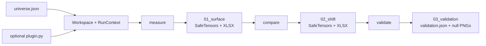

# Source architecture

`src/` owns the installable `barrierlab` package: numerical definitions, data and artifact adapters, pipeline orchestration, presentation, and the command-line entrypoint. It does not own asset-specific experiments—the declarations and optional extensions for those live in [`workspaces/`](../workspaces/README.md)—or the evidence narrative in the [root README](../README.md).

## Public entrypoints

| Entrypoint | Responsibility |
|---|---|
| `barrierlab.cli:main` | Installed `barrierlab` command and argument routing |
| `barrierlab.infrastructure.workspace.Workspace` | Validated view of one `universe.json` and its artifact namespace |
| `barrierlab.pipeline.step_01_surface.cmd_surface` | Stage 1 `measure` implementation |
| `barrierlab.pipeline.step_02_shift.cmd_shift` | Stage 2 `compare` implementation |
| `barrierlab.pipeline.step_03_validation.cmd_validation` | Stage 3 `validate` implementation |
| `barrierlab.pipeline.status.cmd_status` | Read-only workspace and node inspection |

The CLI constructs `Workspace(args.workspace)` relative to `Path.cwd() / "workspaces"`; run it from the repository root unless calling the Python API with an explicit workspace directory.

## Package boundaries

```text
src/barrierlab/
  cli.py              command definitions and dispatch
  domain/             numerical and statistical rules
  infrastructure/     workspace, source, plugin, and persistence adapters
  pipeline/           stage orchestration and status reporting
  presentation/       XLSX and PNG views of existing artifacts
```

### `domain/`

Owns barrier-touch calculations, feature transforms, baseline subtraction, bin scoring, synthetic-null generation, and CPU/CUDA tensor selection. Domain code must not own persistence, CLI behavior, pipeline orchestration, or presentation. Tests enforce that it has no outward dependency on the other package layers.

Key modules:

- `barrier.py` owns `measure_histories()`: quantile edges, the shared incremental excursion ladder, conditional probabilities, counts, and each history's baseline. Stage 1 collects its horizon slices into cubes.
- `features.py` registers built-in features and routes core transforms to `torch_features.py`.
- `shift.py` defines the Stage 2 percentage-point shift and the practical-effect inspection used by node status.
- `scoring.py` owns baseline subtraction, cell eligibility, barrier weights, and the full-grid bin score; cell contributions are private to the bin scorer.
- `validation.py` fits and samples the synthetic OHLC null. Its `score_histories()` measures and scores both the observed batch of one and simulated batches through the same path.
- `tensor_runtime.py` owns the selected Torch device; `configure_cuda()` is invoked before a CLI stage runs.

### `infrastructure/`

Owns all contact with filesystems, workspace declarations, market-data providers, and workspace-local extensions.

- `workspace.py` loads `universe.json` once into `NodeCatalog` and immutable `WorkspaceConfig` objects and maps logical artifacts to paths.
- `market_data.py` registers built-in Yahoo OHLCV, VIX, Treasury-yield, and DXY sources. `SourceRegistry` caches each raw feed once per command and joins secondary histories onto the primary index with forward filling.
- `workspace_plugins.py` loads an optional `workspaces/<name>/plugin.py`. A plugin must expose `register(sources, features)`; registries are recreated for each command.
- `artifact_io.py` is the sole array-persistence owner. It writes SafeTensors plus JSON metadata and restores probability-like arrays as float64 for runtime calculations.
- `artifacts.py` defines the three stage directories and reconstructs aligned OHLCV and feature histories from Stage 2 artifacts.

### `pipeline/`

Owns sequencing, progress reporting, failure isolation by node, timestamps, provenance metadata, and the transition between domain operations and persisted artifacts. A pipeline module may use domain, infrastructure, and presentation APIs. It should not redefine their calculations or schemas.

`RunContext` creates fresh source and feature registries for one command, loads the workspace plugin, caches source panels, and reuses forward excursions for nodes sharing a source set.

### `presentation/`

Owns human-readable workbooks and plots. It consumes artifact data and may use domain helpers, but must not invoke pipeline commands or depend on the CLI. Presentation files are derived views; arrays and JSON remain the machine-readable contract.

## Data and artifact flow



Stages are restartable but ordered. A missing prerequisite produces a compact report rather than synthesizing upstream data.

### Stage 1: `measure`

For every declared node, load its requested data sources, compute the feature, create quantile bins, and calculate:

```text
P(price touches signed barrier Δ within horizon t | feature bin)
```

The SafeTensors cube includes probabilities, hit counts, bin counts, barrier and horizon axes, bin edges, metadata, and the ordered market/feature history needed downstream. The `baseline` node supplies the unconditional surface.

### Stage 2: `compare`

Subtract the baseline for the same signed barrier and horizon:

```text
shift[Δ, bin, t] = 100 × (P(touch Δ by t | bin) − P(touch Δ by t))
```

The unit is percentage points. Stage 2 carries the original probabilities, baseline, counts, axes, and history forward so later stages do not need Stage 1 files to interpret the shift.

### Stage 3: `validate`

Validation tests every eligible bin of every available non-baseline node from `02_shift`. There is no selection command, top-k filter, rank, or representative cell. Selection will be designed downstream of validation later.

`validation.score_histories()` is the common entrypoint for observed and simulated histories. The pipeline constructs one feature policy and passes it unchanged to both calls. The observed input is the embedded OHLCV history as a batch of one; stored probability, baseline, shift, and count arrays are not scoring inputs.

```text
observed stored OHLCV / generated null OHLCV
  -> validation.score_histories()
  -> core feature recomputation / fixed external values
  -> barrier.measure_histories()
  -> scoring.bin_scores() for each measured horizon
  -> accumulated scores, validity, and actual bin edges
```

`scoring.bin_scores(prob, base, bin_n, deltas)` is the shared bin-scoring kernel. Inputs are in-memory arrays or tensors. Probability axes are `(..., signed_barrier, bin, horizon)`; baseline omits bin and counts omit barrier. Results contain only `scores` and `valid`, each shaped `(..., bin)`.

```text
shift      = 100 * (conditional probability - baseline)
cell score = abs(shift(+D) - shift(-D)) * abs(D) / largest paired abs(D)
bin score  = sum of eligible cell scores over paired barriers and horizons
```

Cell contributions are private, vectorized intermediate tensors. A bin needs at least 30 observations and each barrier/horizon needs two usable bins. An unsupported bin has zero score and false validity; a supported zero-score bin is still tested. Stored probability and shift cubes remain presentation artifacts. Validation remeasures conditional probabilities and each history's own baseline in float64, avoiding stored float32 probability rounding. Baselines include all eligible market dates, including feature warm-up.

Validation reconstructs the exact observed OHLCV and feature histories stored in each Stage 2 artifact. It fits a four-component multivariate Gaussian to:

```text
log(open / previous close)
log(close / open)
log(high / max(open, close))
log(low / min(open, close))
```

With deterministic seed `20260907`, it draws 10,000 histories of the observed length and rebuilds valid OHLC bars. Nodes with identical stored market histories share one synthetic ensemble; different histories are simulated separately, retaining one ensemble at a time.

Core OHLCV features are recomputed for both the observed history and each synthetic path. External, calendar, and workspace-plugin features cannot be derived from synthetic OHLC alone, so the same stored condition values and edges are used for the observed history and broadcast across null paths. Volume is also carried from the observed history.

Both validation roles use the same measurement iterator as Stage 1, including its forward-extreme calculation, quantiles, bin assignment, touch rates, and horizon order. Non-finite feature values are excluded from quantiles, ties are deduplicated, and values equal to an edge enter the lower bin. Core features use the workspace's requested quantile count, with collapsed bins padded internally; fixed external features retain the observed edges. Each path supplies its own unconditional probabilities to `scoring.bin_scores`. Both observed and null scores accumulate the same horizon slices in the same order. Observed labels come from the recomputed edges, and trailing padded bins are excluded from observed records.

For each eligible condition bin, validation recomputes the complete linearly barrier-weighted grid score. It records:

- `node`, `bin`, `bin_number`, `bin_label`: stable condition identity, independent of rank;
- `bin_score`: observed full-grid score;
- `null_scores`: all 10,000 synthetic scores;
- `null_p95`: their 95th percentile;
- `peak_p`: `(1 + count(null_score >= observed)) / (1 + 10000)`;
- `cleared`: whether raw `peak_p < 0.05`;
- `n_paths`, `n_valid_null`: ensemble size and number of supported null bins. Unsupported null bins retain zero contributions in the full ensemble, preserving the scoring rule.

`skipped_bins` records observed bins without eligible cells. Missing declared Stage 2 nodes are listed in `missing_nodes` and make the summary incomplete.

`validation.json` fingerprints Stage 2 file contents, node declarations, and requested bin count. Its method records measurement/scoring/null versions, seed, path count, threshold, and invalid-null policy. Status rejects incomplete or mismatched results. The `shared-history-float64-v1` measurement version invalidates results that scored stored probabilities; rerun `validate` to remeasure stored histories. Old `03_selection/` and `04_validation/` outputs are not consumed or migrated. Run `validate` to produce `03_validation/`; rerun `measure` and `compare` first if their inputs or numerical definitions changed. Existing generated directories are left on disk.


## Statistical boundary

The current validator is a fitted synthetic null, not a market simulator or strategy backtest. Its per-bar draws preserve the fitted mean and covariance among the four log-OHLC components. They do not preserve empirical temporal order, autocorrelation, volatility clustering, regime transitions, liquidity, execution, or trading costs. External condition histories remain fixed, and the raw 5% decision rule has no multiple-testing correction.

Changing any of these assumptions changes the experiment contract. Update the implementation, validation metadata, plots, tests, and documentation together.

## Sources of truth

| Fact | Source of truth |
|---|---|
| CLI commands and options | `barrierlab/cli.py` |
| Asset, nodes, grid, horizons, and bin count | `workspaces/<name>/universe.json` |
| Feature and source implementations | `domain/features.py`, `domain/torch_features.py`, `infrastructure/market_data.py`, workspace plugin |
| Stage paths and filenames | `infrastructure/artifacts.py` |
| SafeTensors payload schemas | `infrastructure/artifact_io.py` |
| Bin-score formula | `domain/scoring.py` and `03_validation/validation.json` metadata |
| History measurement | `domain/barrier.py` (`measure_histories`) |
| Observed/null calculation and null generation | `domain/validation.py`; measurement delegates to `domain/barrier.py` and scoring to `domain/scoring.py` |
| Validation threshold and fingerprint | `pipeline/step_03_validation.py` and `03_validation/validation.json` |

Do not copy formulas, paths, or configuration into a second executable source. Documentation should name the owner and explain its consequence.

## Common changes

| Change | Start here | Also verify |
|---|---|---|
| Add a reusable OHLCV indicator | `domain/torch_features.py`, then `domain/features.py` | Synthetic-path recomputation and observed/null parity tests |
| Add a built-in data source | `infrastructure/market_data.py` | Registry caching and index alignment |
| Add an experiment-only source or feature | Workspace `plugin.py` | [`workspaces/README.md`](../workspaces/README.md) contract |
| Change a stage artifact | `infrastructure/artifacts.py` and `artifact_io.py` | Downstream loaders, fingerprints, status, and artifact tests |
| Change bin scoring | `domain/scoring.py` | Observed/null validation share this kernel; update its version and parity tests |
| Change the null | `domain/validation.py` | Stage 3 metadata, plots, current-summary check, and statistical disclosure |
| Change a workbook or plot | `presentation/` | Keep machine-readable artifacts unchanged |
| Add or rename a CLI command | `cli.py` | Pipeline order and CLI contract tests |

Run the [test suite](../tests/README.md) after any source change. A real workspace rerun is additionally required for changes to market data, numerical kernels, feature definitions, bin scoring, null generation, or presentation artifacts.
