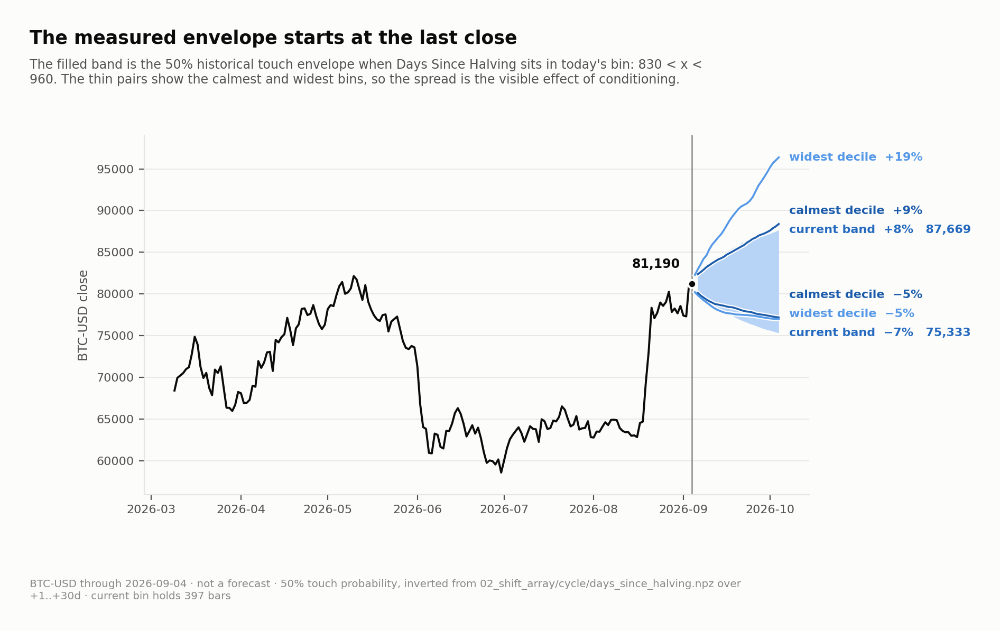
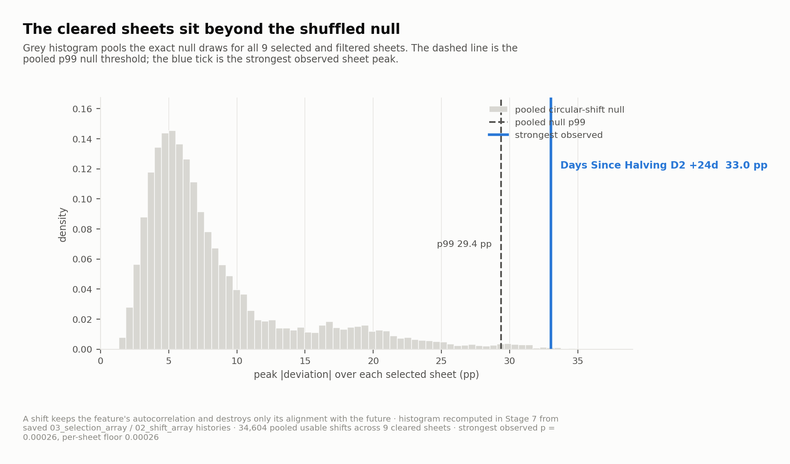
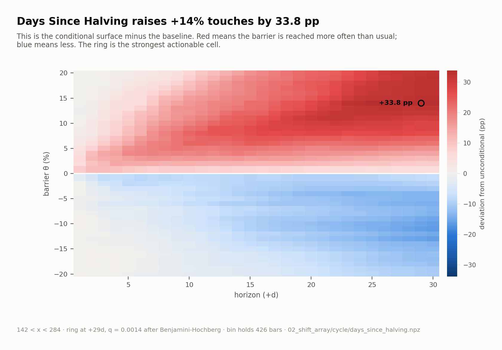
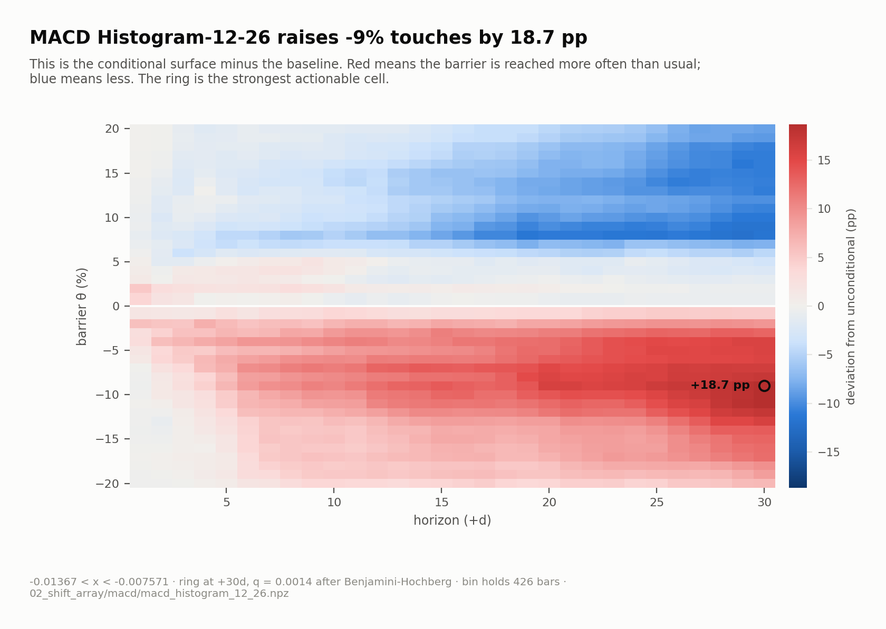
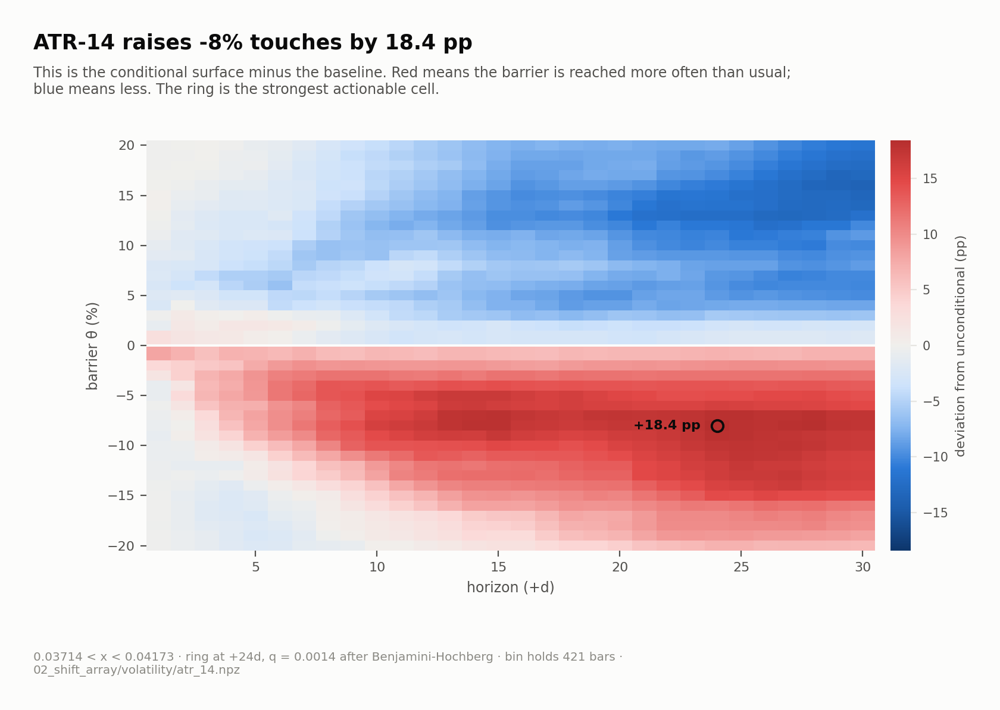
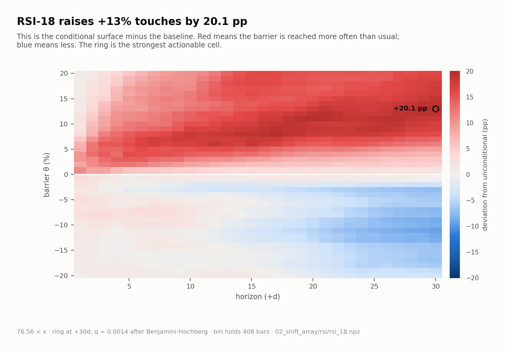
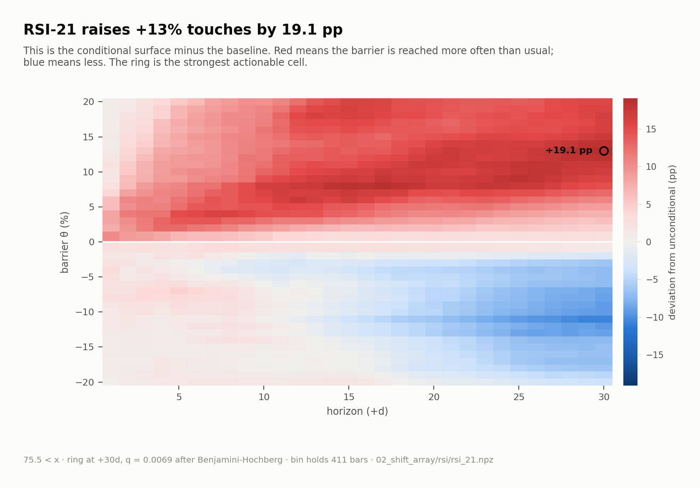
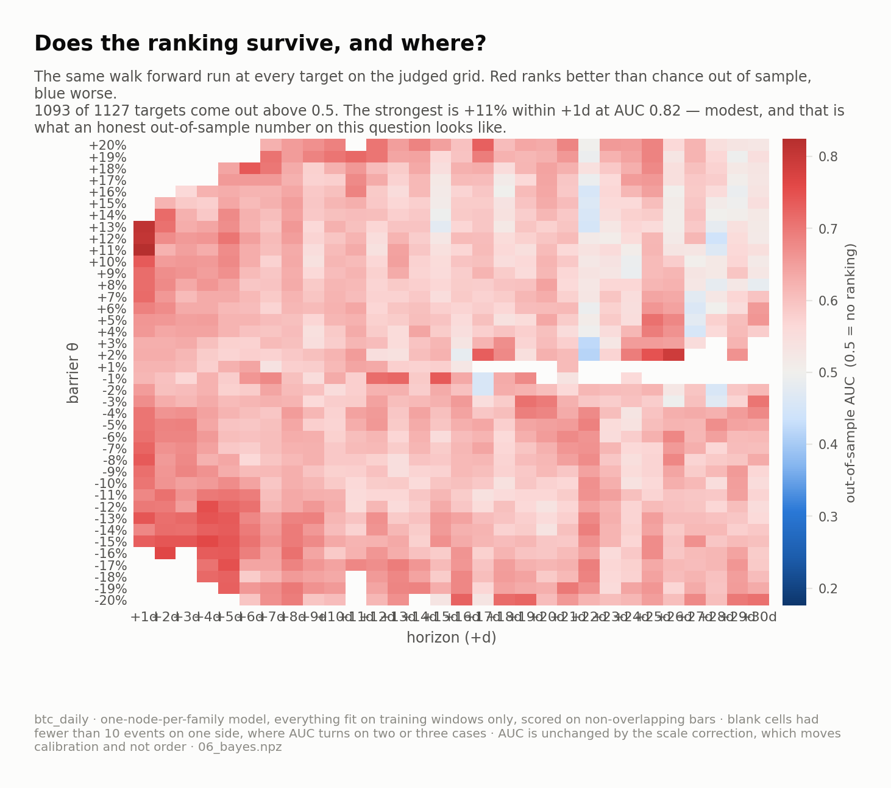
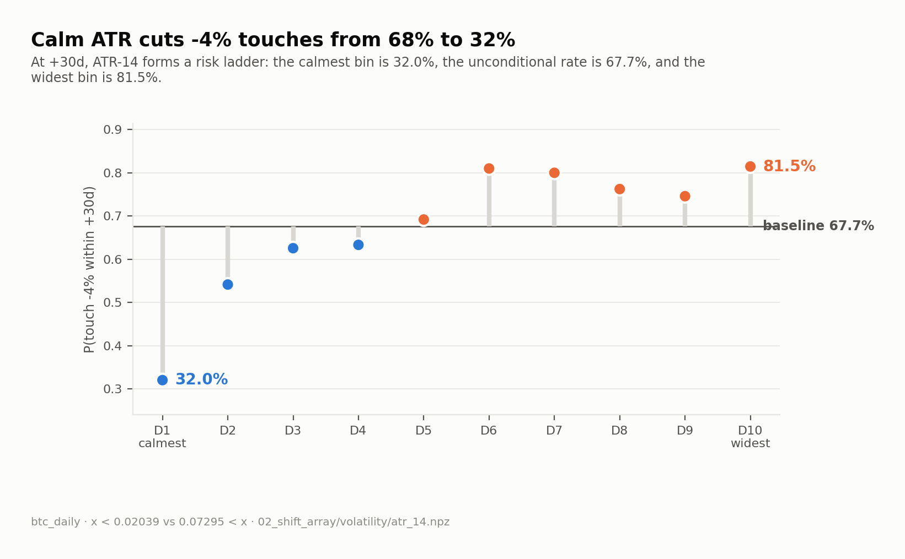
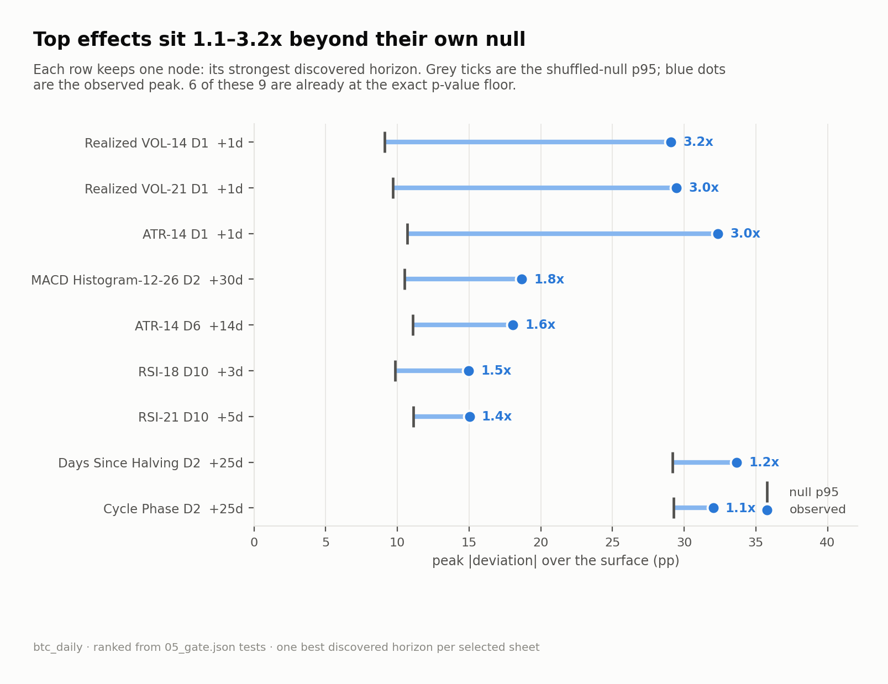

# btc_daily

`BTC-USD` · 1d · from 2015-01-01 · 66 nodes

### The measured forward envelope starts at the last close.

### The exact circular-shift null threshold and its resolution floor.

### days_since_halving_bin2: strongest cleared conditional deviation from the baseline.

### atr_14_bin1: strongest cleared conditional deviation from the baseline.

### realized_vol_14_bin1: strongest cleared conditional deviation from the baseline.

### macd_histogram_12_26_bin2: strongest cleared conditional deviation from the baseline.

### atr_14_bin6: strongest cleared conditional deviation from the baseline.

### realized_vol_21_bin1: strongest cleared conditional deviation from the baseline.

### rsi_18_bin10: strongest cleared conditional deviation from the baseline.

### rsi_21_bin10: strongest cleared conditional deviation from the baseline.

### cycle_phase_bin2: strongest cleared conditional deviation from the baseline.

### Where the composed ranking survives out of sample.

### ATR turns one barrier into a visible risk ladder.

### The strongest discoveries sit far beyond their own null thresholds.

