# btc_daily

`BTC-USD` · 1d · from 2015-01-01 · 66 nodes

### A. The measured forward envelope starts at the last close.

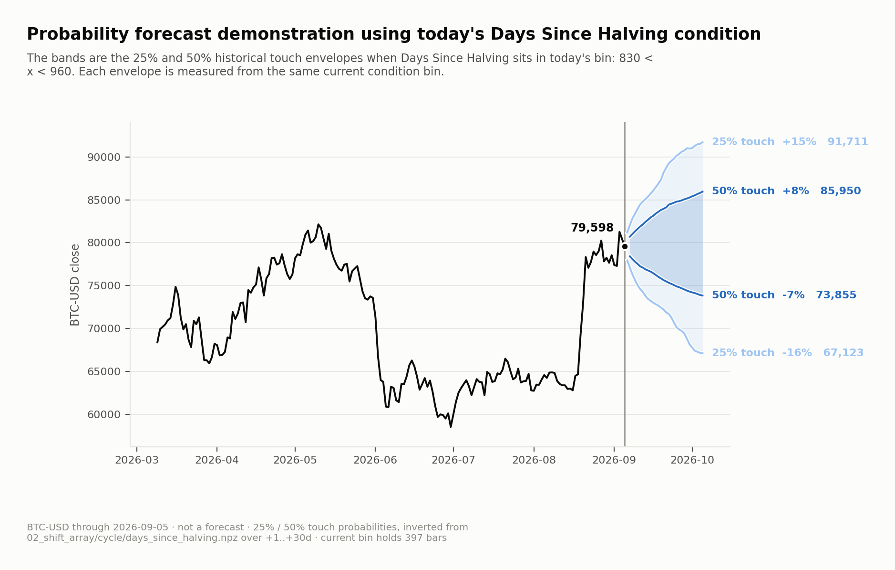

### B. The exact circular-shift null threshold and its resolution floor.

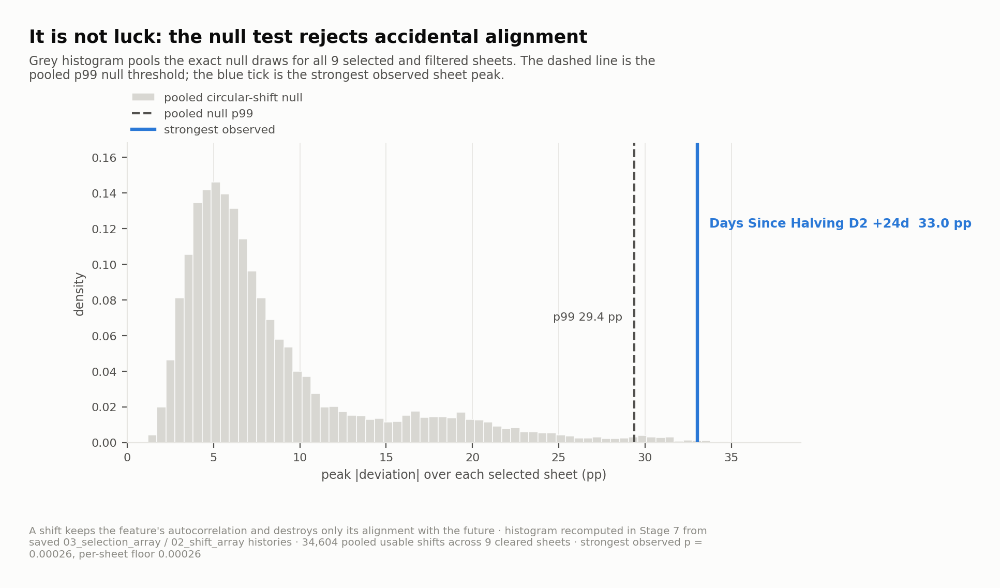

### C. days_since_halving_bin2: strongest cleared conditional deviation from the baseline.

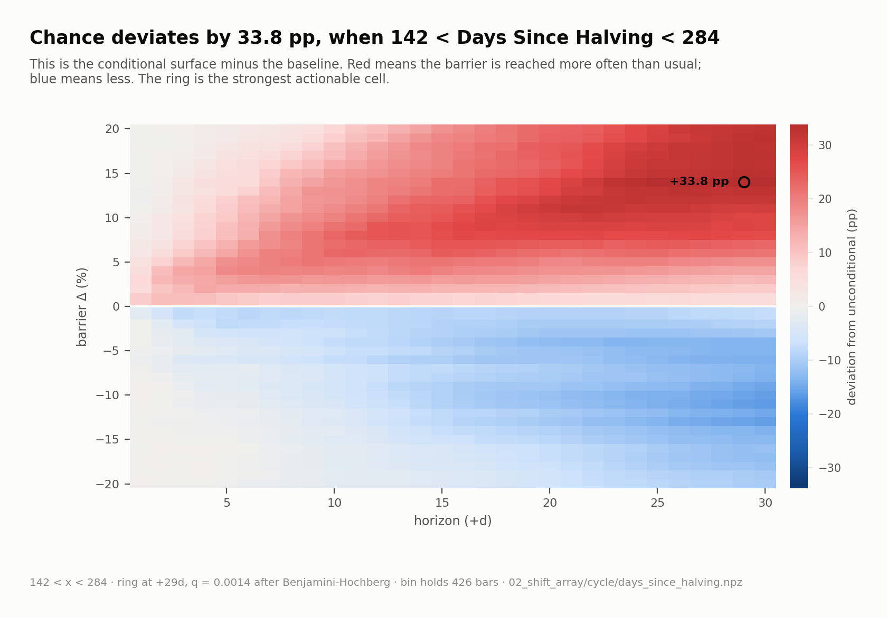

### C. atr_14_bin1: strongest cleared conditional deviation from the baseline.

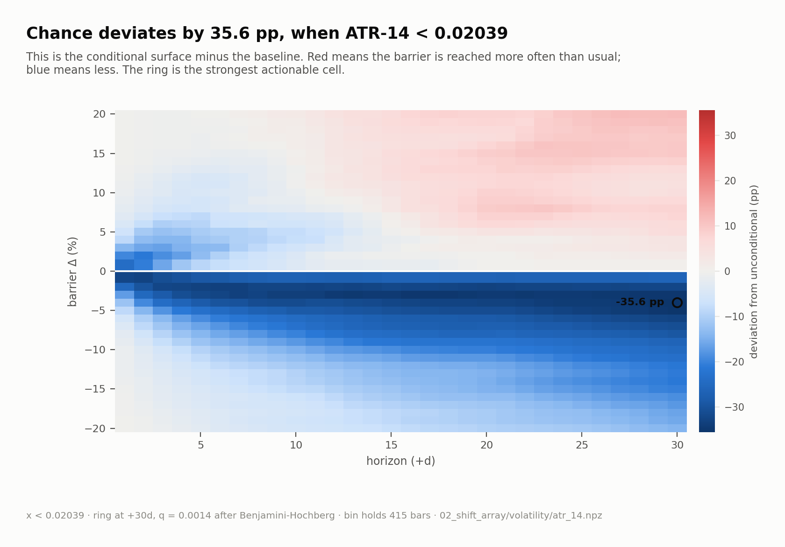

### C. realized_vol_14_bin1: strongest cleared conditional deviation from the baseline.

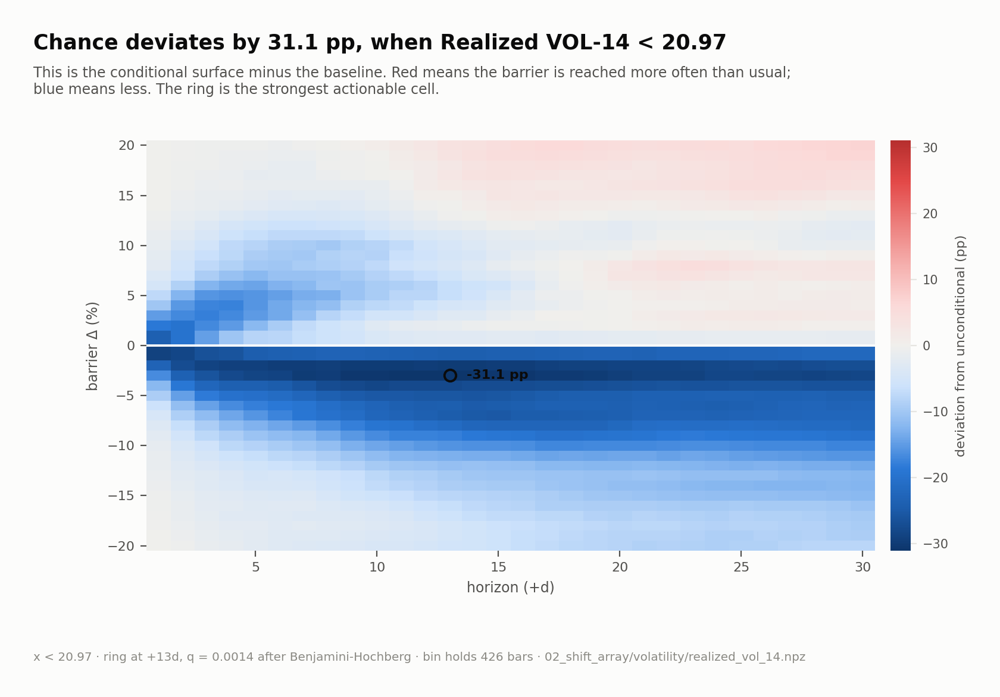

### C. macd_histogram_12_26_bin2: strongest cleared conditional deviation from the baseline.

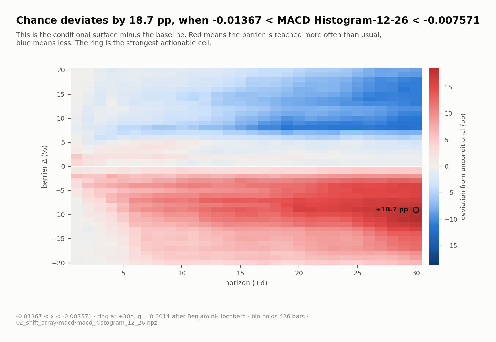

### C. atr_14_bin6: strongest cleared conditional deviation from the baseline.

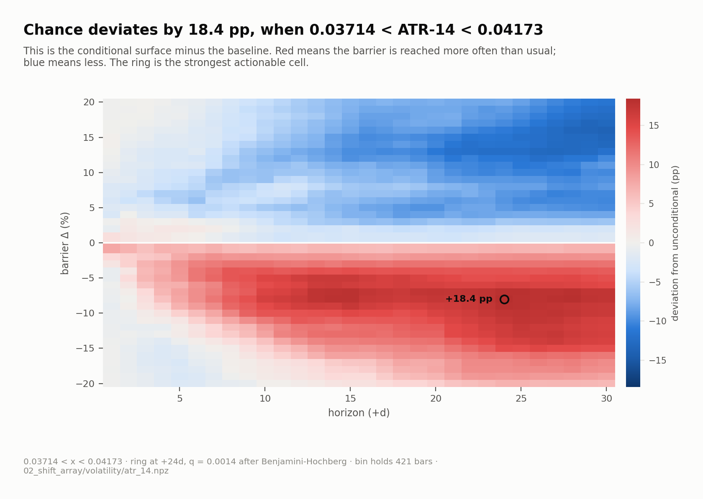

### C. realized_vol_21_bin1: strongest cleared conditional deviation from the baseline.

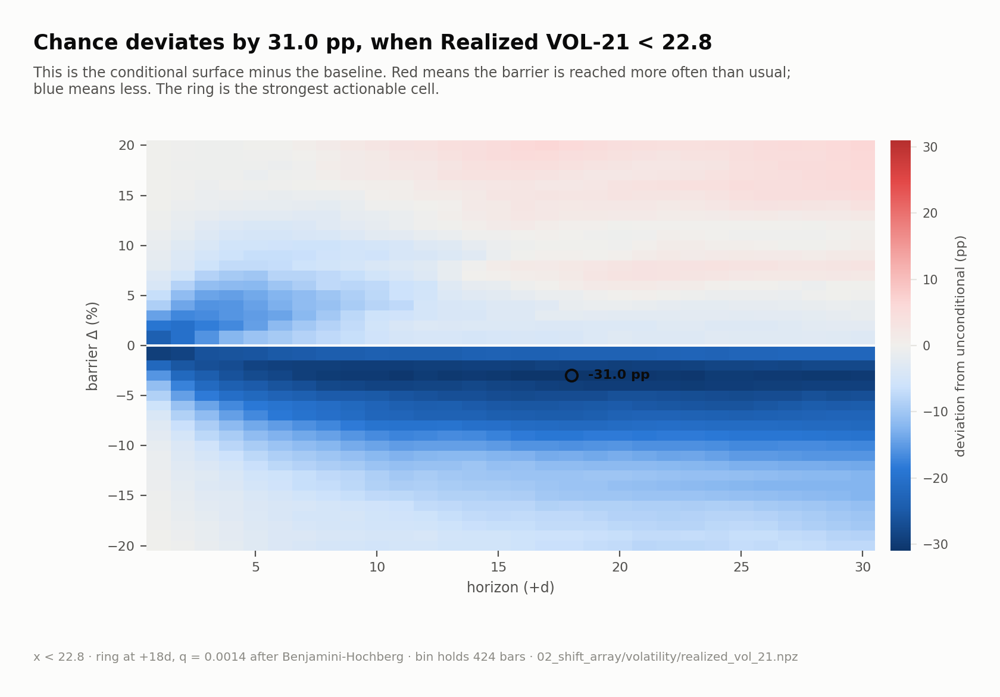

### C. rsi_18_bin10: strongest cleared conditional deviation from the baseline.

### C. rsi_21_bin10: strongest cleared conditional deviation from the baseline.

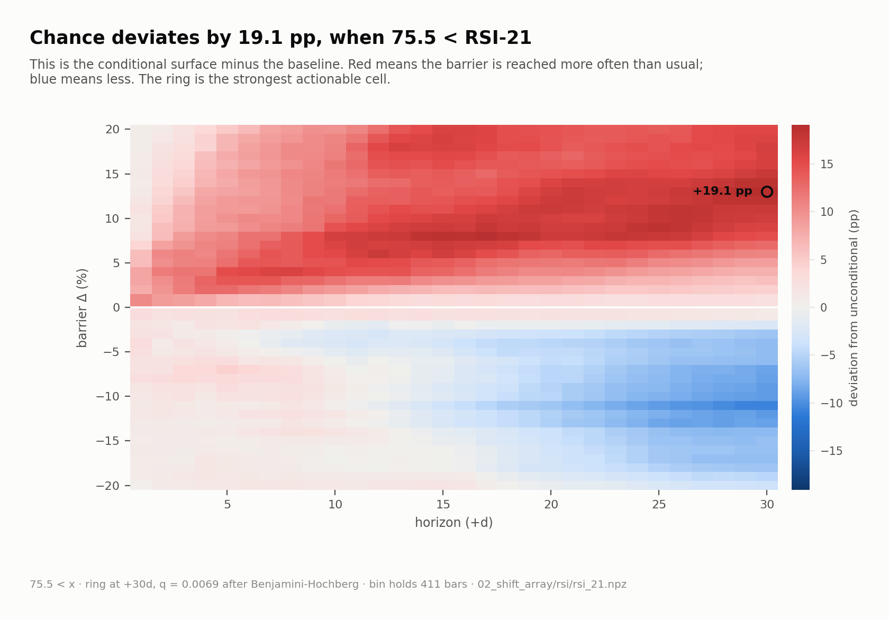

### C. cycle_phase_bin2: strongest cleared conditional deviation from the baseline.

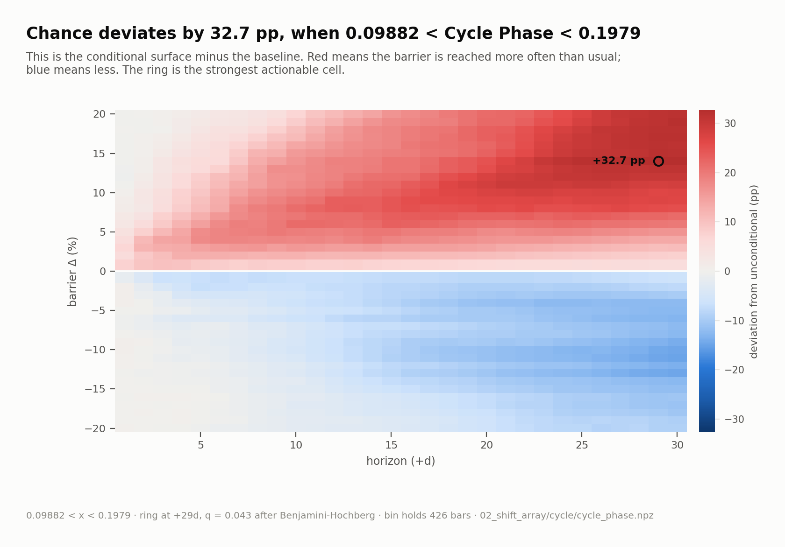

### D. The strongest discoveries sit far beyond their own null thresholds.

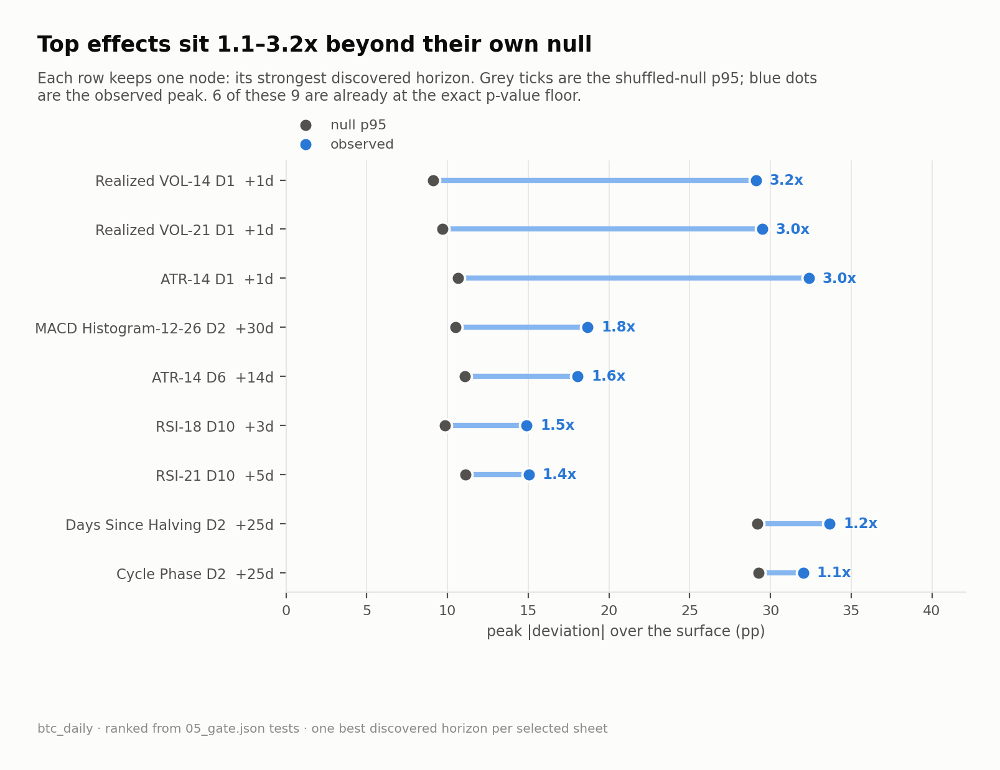
