# nasdaq_daily

`^IXIC` · 1d · from 2015-01-01 · 58 nodes

### The measured forward envelope starts at the last close.

### The exact circular-shift null threshold and its resolution floor.

### vix_level_bin10: strongest cleared conditional deviation from the baseline.

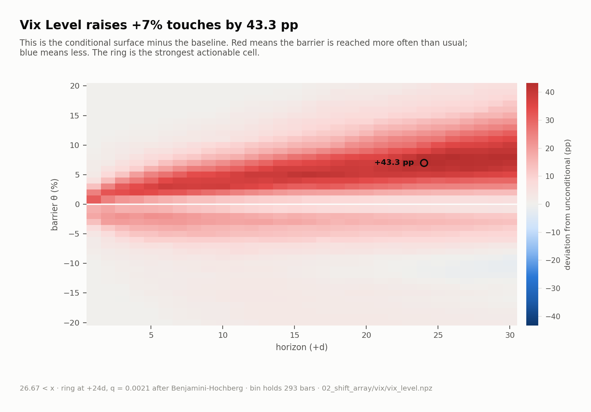

### ma_ratio_200_bin5: strongest cleared conditional deviation from the baseline.

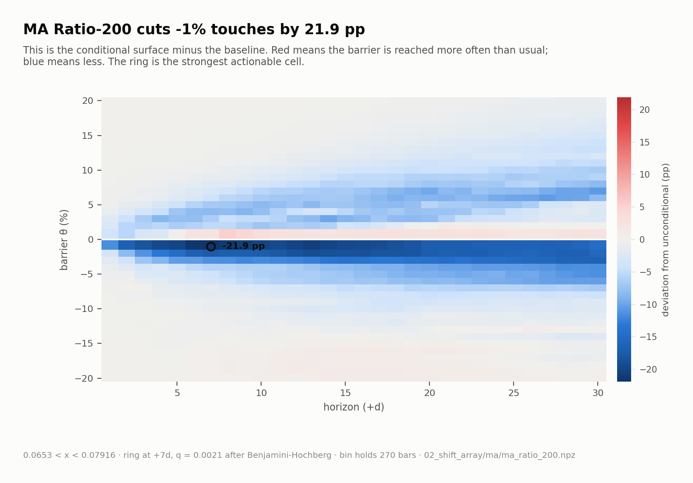

### ma_cross_20_100_bin5: strongest cleared conditional deviation from the baseline.

### tnx_ma_ratio_20_bin1: strongest cleared conditional deviation from the baseline.

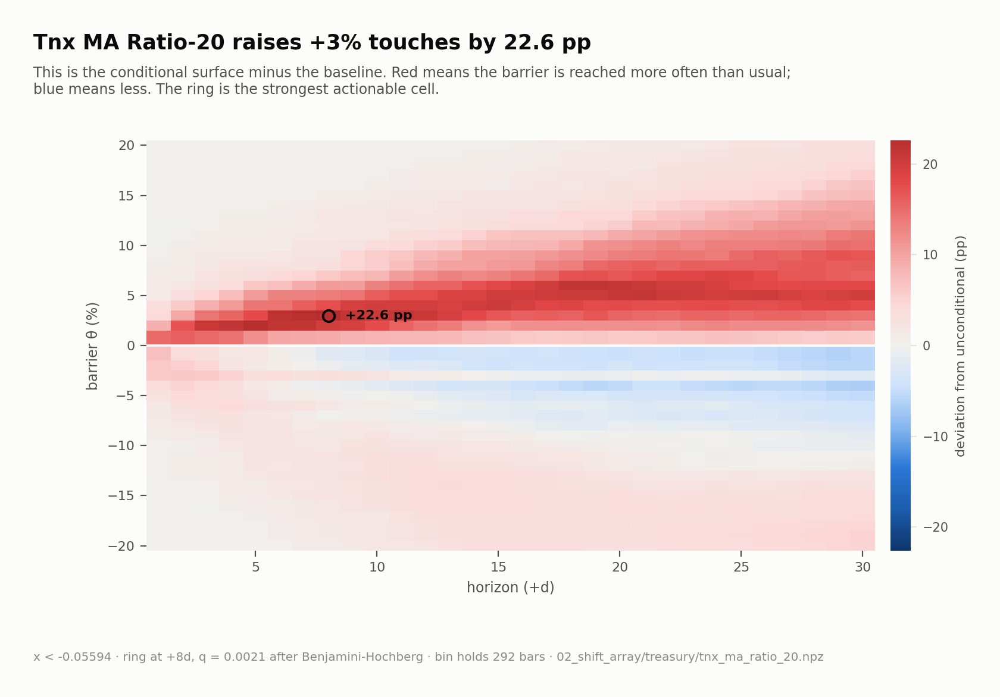

### drawdown_recovery_7_60_bin6: strongest cleared conditional deviation from the baseline.

### realized_vol_30_bin10: strongest cleared conditional deviation from the baseline.

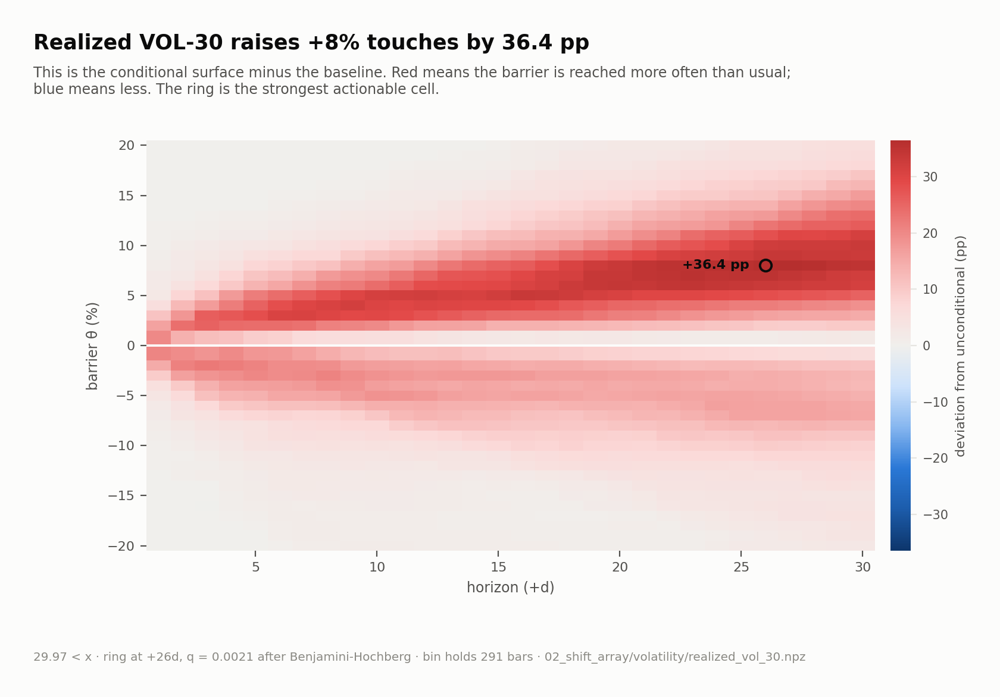

### bb_width_20_bin8: strongest cleared conditional deviation from the baseline.

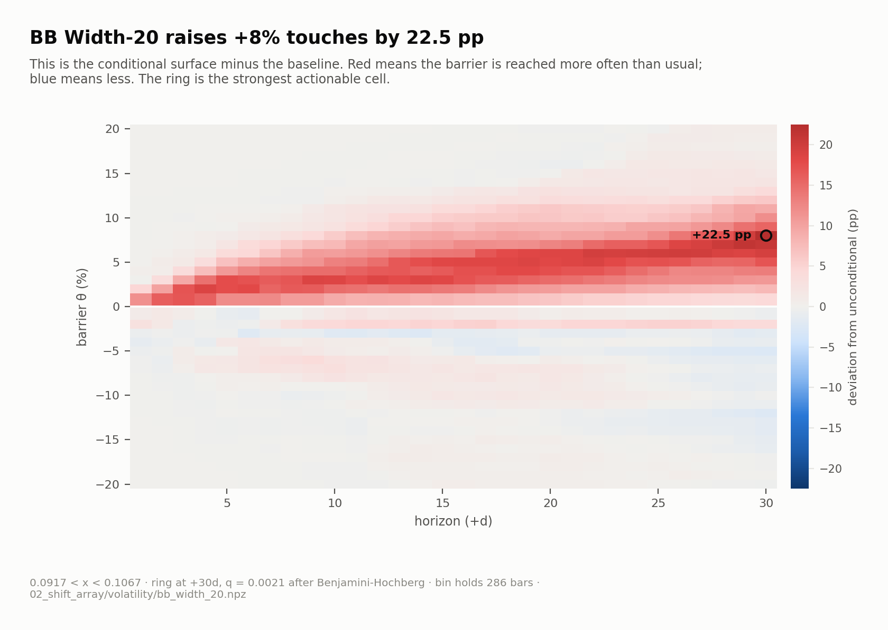

### vix_level_bin1: strongest cleared conditional deviation from the baseline.

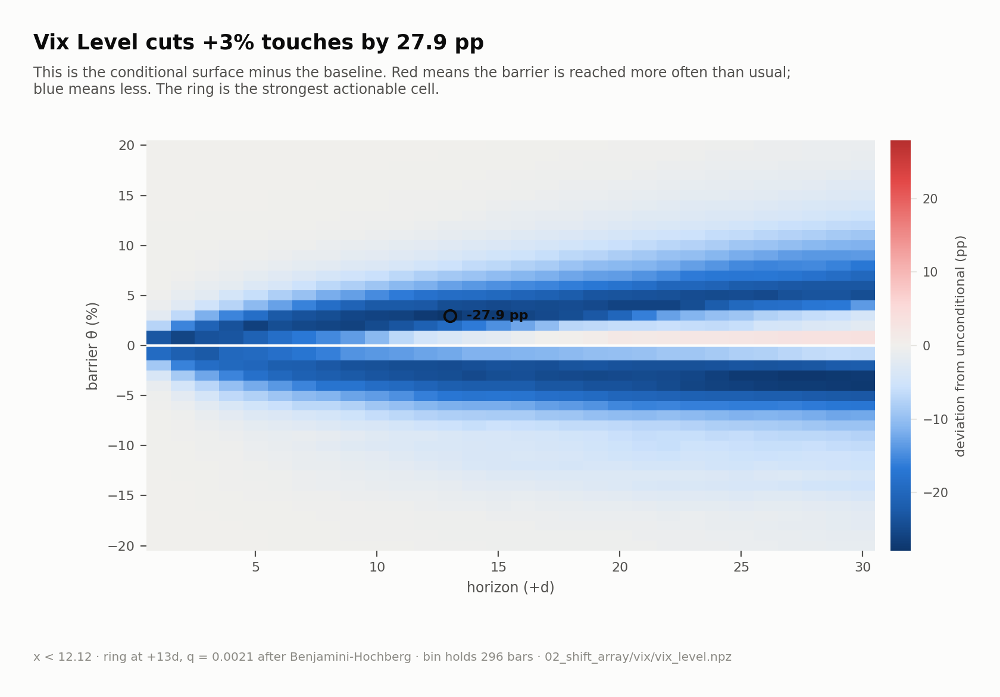

### rsi_14_bin10: strongest cleared conditional deviation from the baseline.

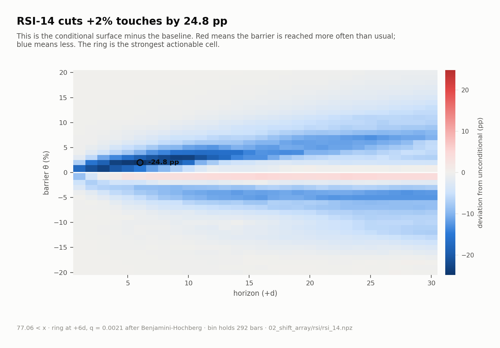

### vix_level_bin3: strongest cleared conditional deviation from the baseline.

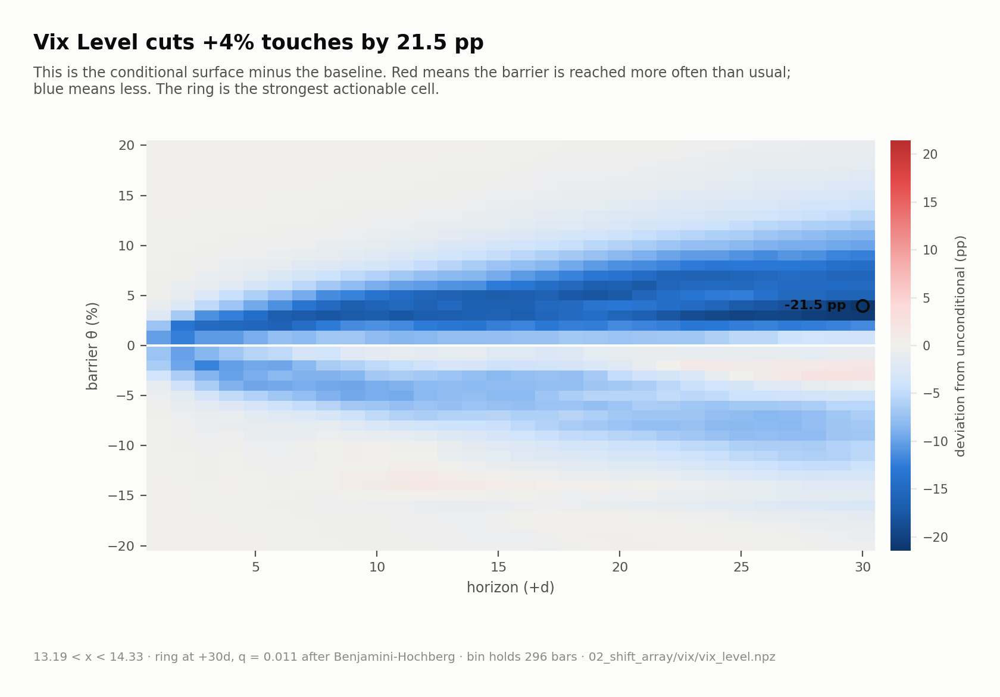

### ma_ratio_200_bin6: strongest cleared conditional deviation from the baseline.

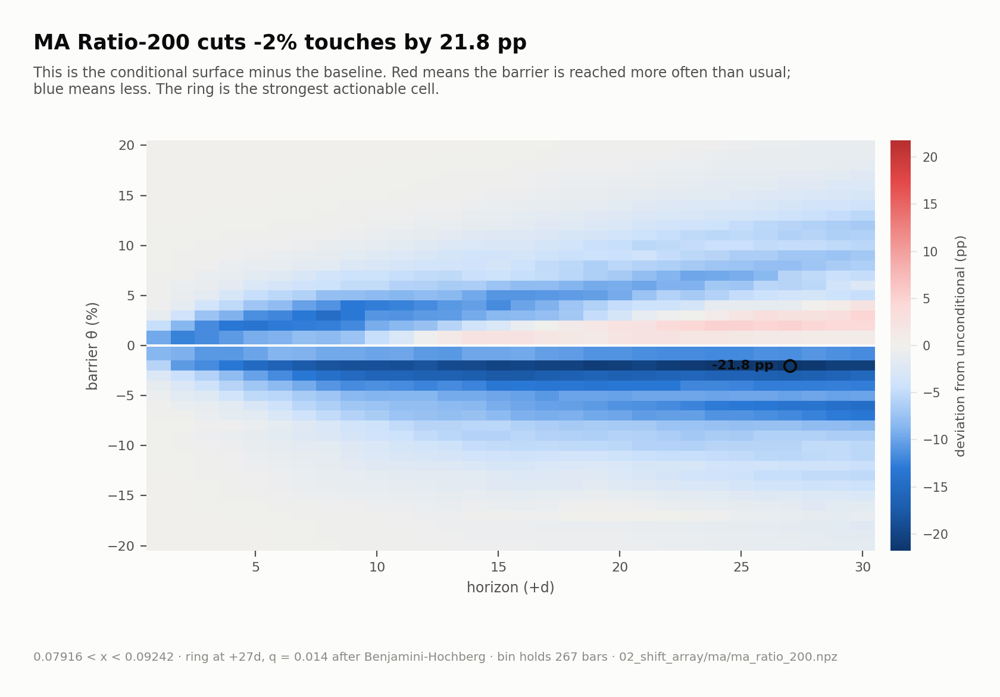

### ma_ratio_100_bin3: strongest cleared conditional deviation from the baseline.

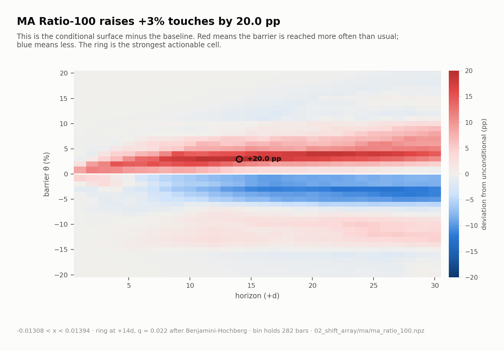

### ma_ratio_200_bin4: strongest cleared conditional deviation from the baseline.

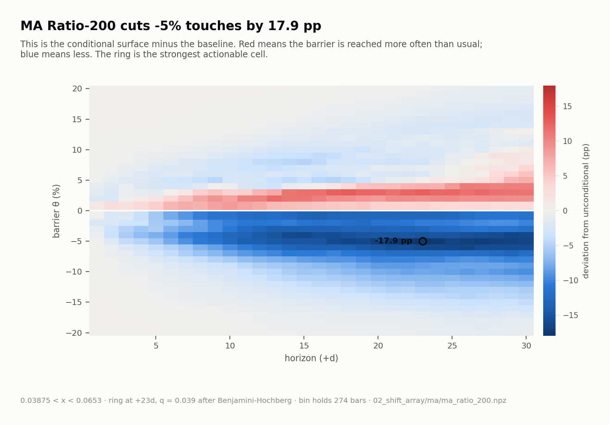

### tnx_level_bin1: strongest cleared conditional deviation from the baseline.

### Where the composed ranking survives out of sample.

### The strongest discoveries sit far beyond their own null thresholds.

