# nasdaq_daily

`^IXIC` · 1d · from 2015-01-01 · 58 nodes

### A. The measured forward envelope starts at the last close.

### B. The exact circular-shift null threshold and its resolution floor.

### C. vix_level_bin10: strongest cleared conditional deviation from the baseline.

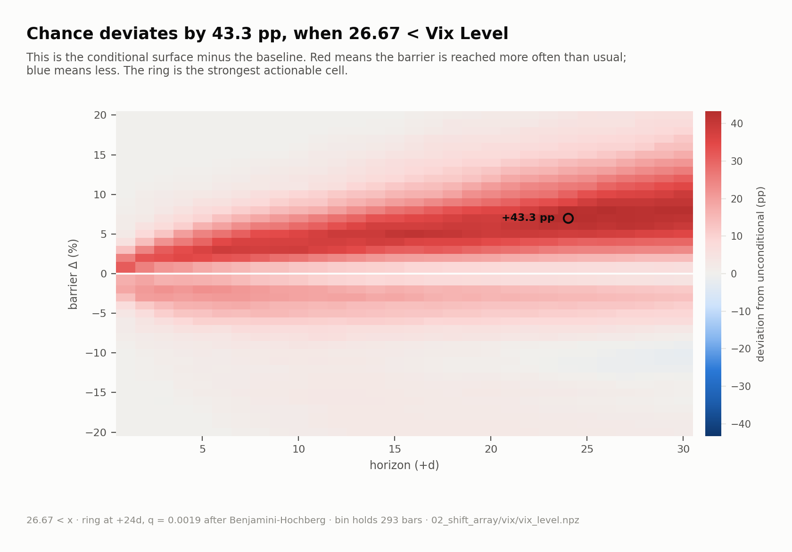

### C. ma_ratio_200_bin5: strongest cleared conditional deviation from the baseline.

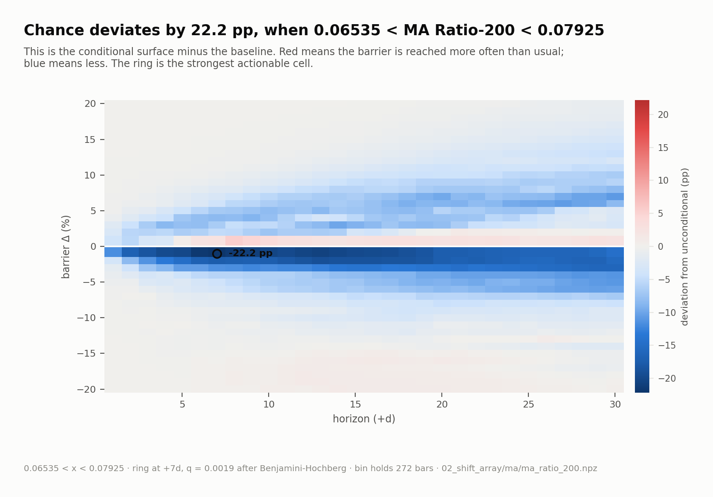

### C. ma_cross_20_100_bin5: strongest cleared conditional deviation from the baseline.

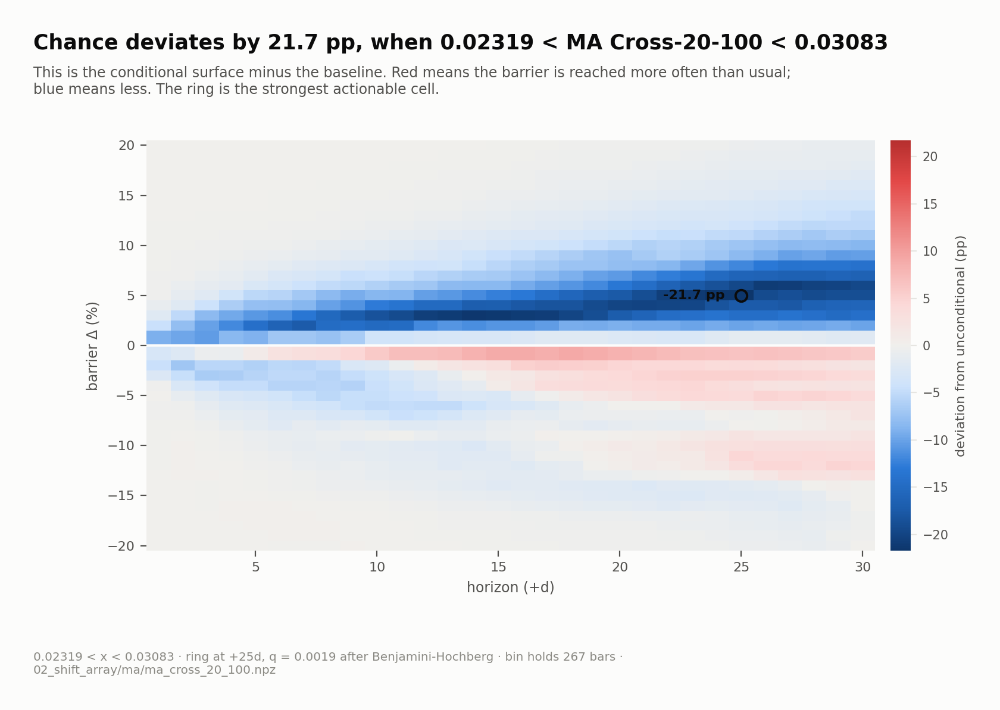

### C. tnx_ma_ratio_20_bin1: strongest cleared conditional deviation from the baseline.

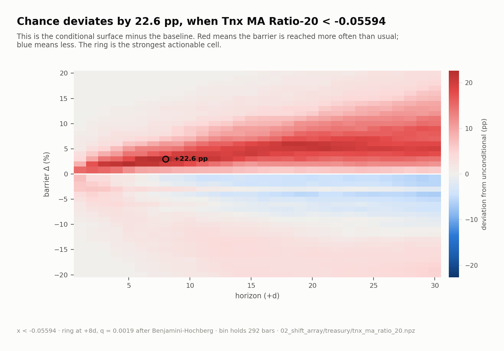

### C. drawdown_recovery_7_60_bin6: strongest cleared conditional deviation from the baseline.

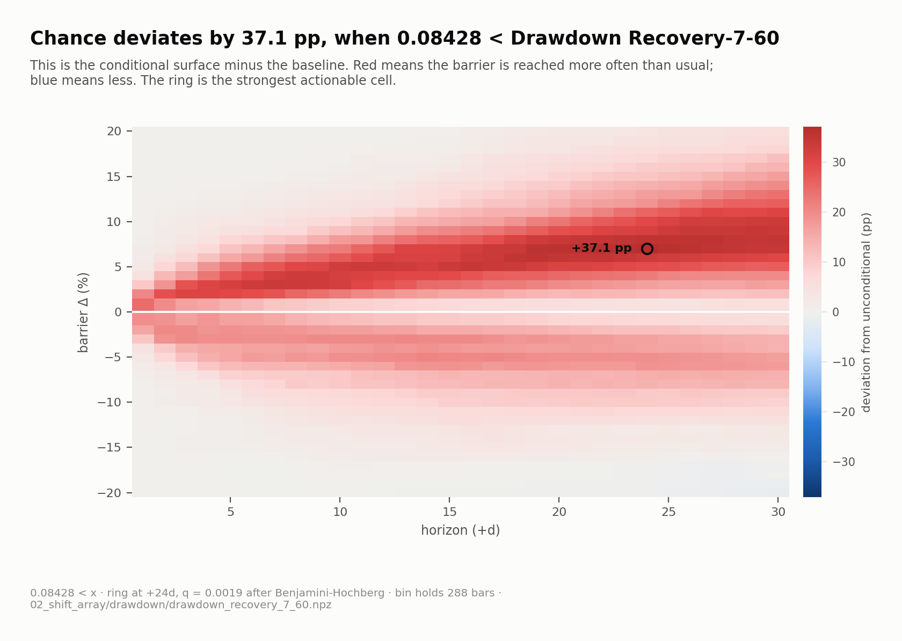

### C. realized_vol_30_bin10: strongest cleared conditional deviation from the baseline.

### C. bb_width_20_bin8: strongest cleared conditional deviation from the baseline.

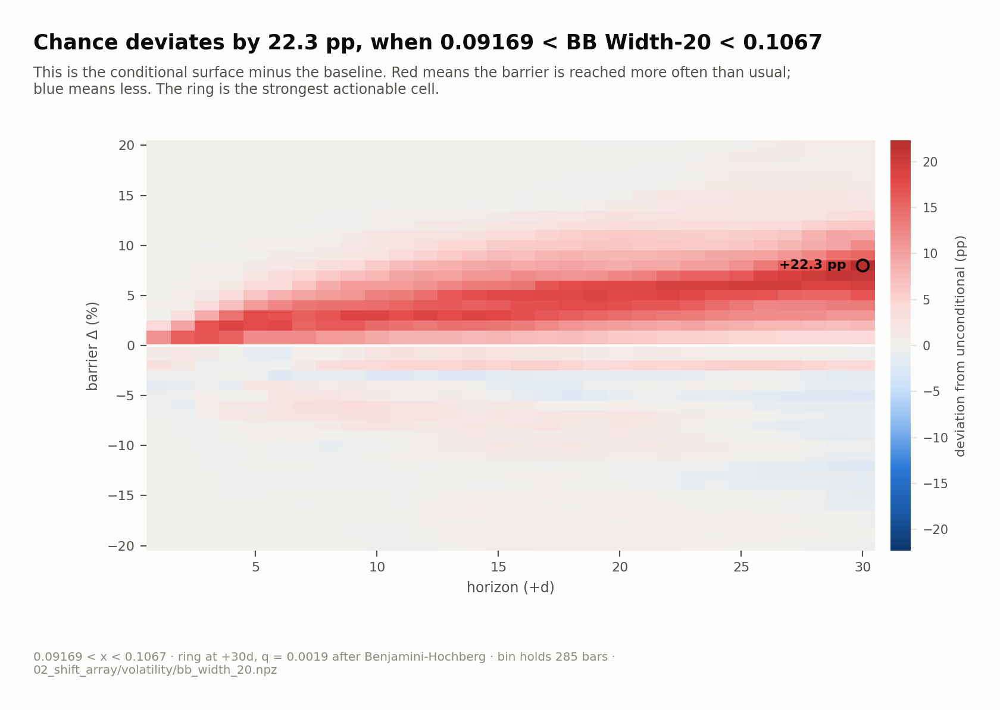

### C. vix_level_bin1: strongest cleared conditional deviation from the baseline.

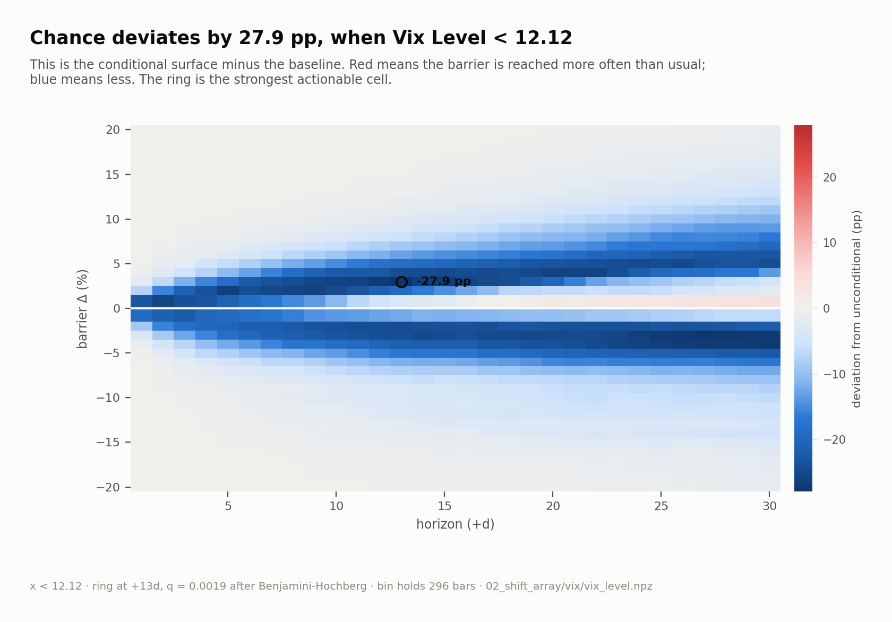

### C. ma_ratio_100_bin8: strongest cleared conditional deviation from the baseline.

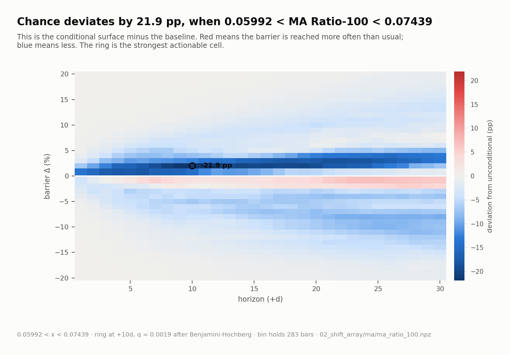

### C. vix_level_bin3: strongest cleared conditional deviation from the baseline.

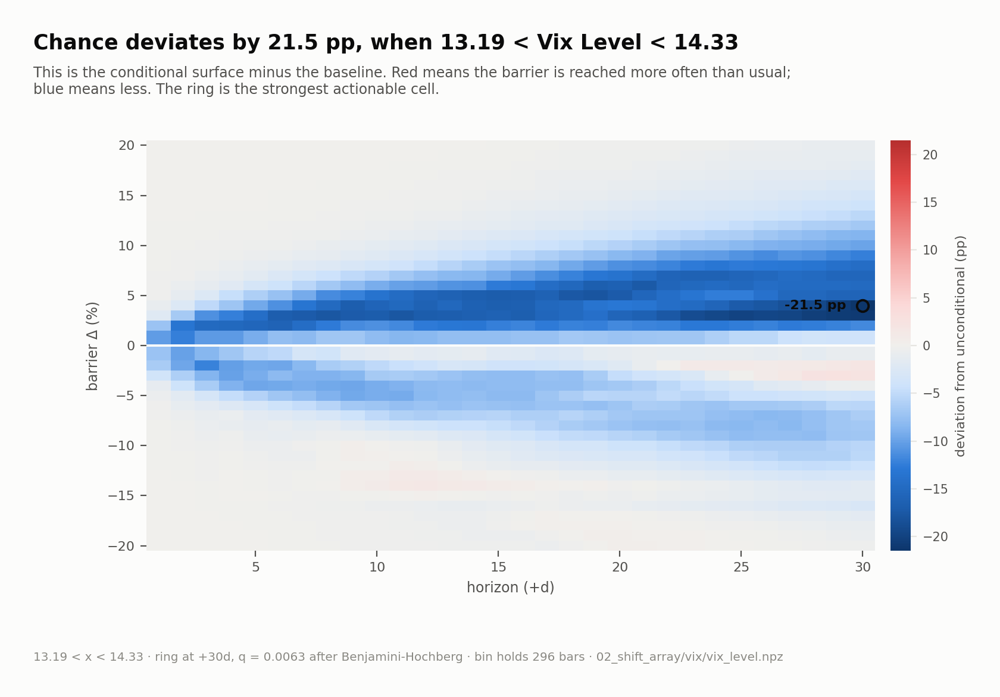

### C. ma_ratio_200_bin6: strongest cleared conditional deviation from the baseline.

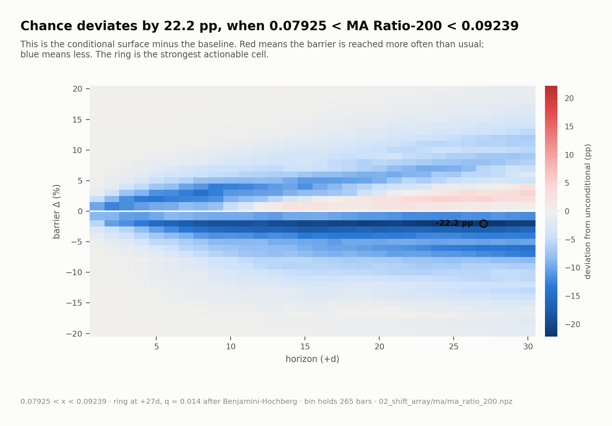

### C. ma_ratio_100_bin3: strongest cleared conditional deviation from the baseline.

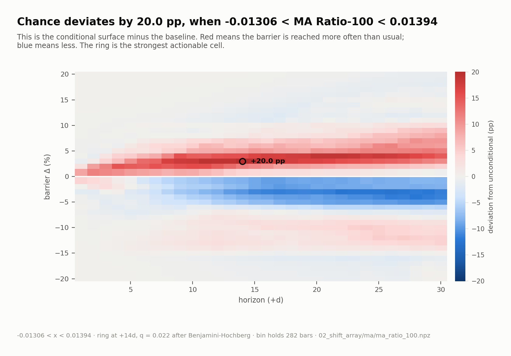

### C. ma_ratio_200_bin4: strongest cleared conditional deviation from the baseline.

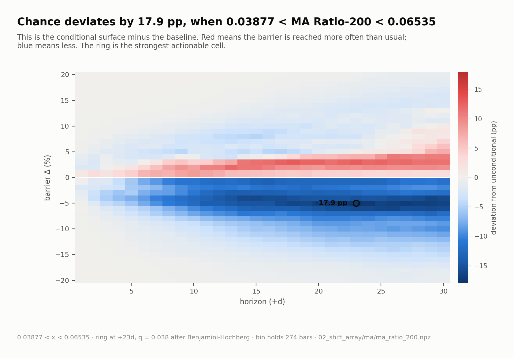

### C. tnx_level_bin1: strongest cleared conditional deviation from the baseline.

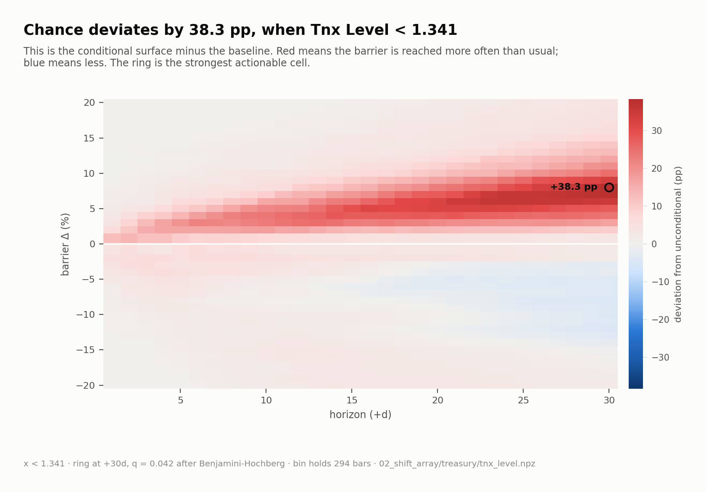

### D. The strongest discoveries sit far beyond their own null thresholds.

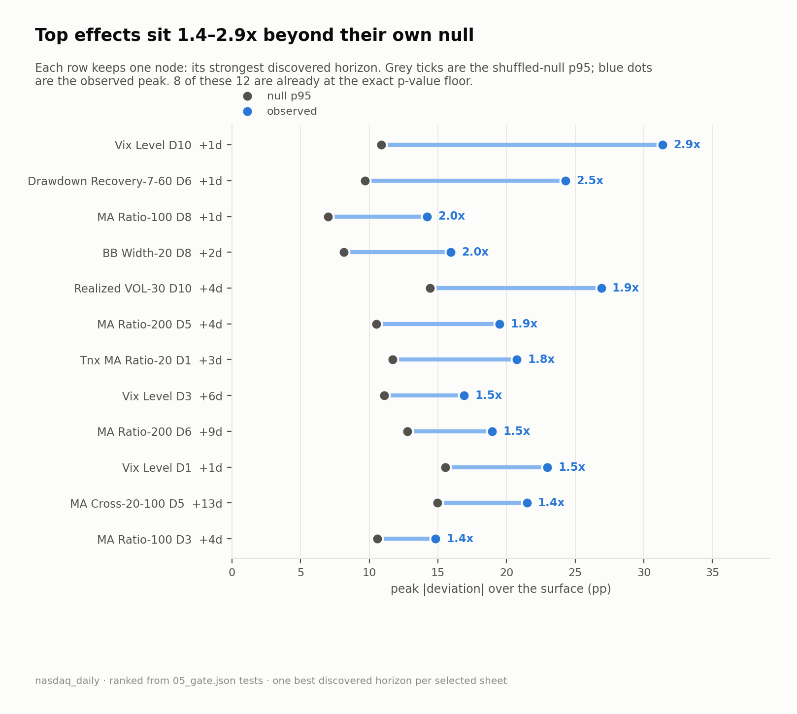
